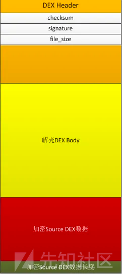
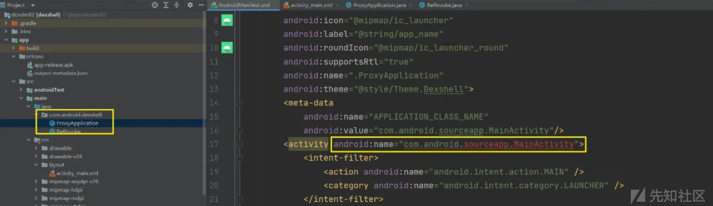
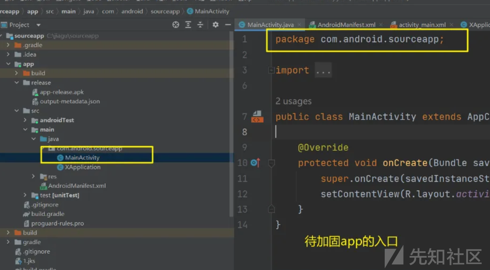
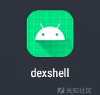

# Android第一代落地DEX加固总结 - 先知社区

Android第一代落地DEX加固总结

- - -

第一代dex落地壳加固是Android加固的基础，近日学习加固相关知识，记录一下自己踩过的坑和总结自己对落地壳的理解。  
下面的代码或多或少参考了大佬们的代码，主要是加上自己的理解和注释，经过折腾最终在最新版雷电模拟器9（Android9）实现了加固和自解密运行。  
参考项目和文章会放在末尾。

## 1、理论知识

关于DEX文件的组成，可以自行搜索详细学习  
在Android的DEX加固中，主要和DEX头部三个字段有关，分别是：

-   checksum  
    文件校验码，使用alder32算法校验文件除去maigc，checksum外余下的所有文件区域
-   signature  
    使用SHA-1算法hash除去magic、checksum和signature外余下的所有文件区域
-   file\_size  
    dex文件的大小  
    DEX加固主要就是一个拼接  
    成品 = 待加固app（会经过加密） + 解密dex  
    经过拼接之后，会影响上面说的3个字段，所以需要我们手动去修改更正。

[](https://xzfile.aliyuncs.com/media/upload/picture/20240129164440-a434f668-be82-1.png)

这里借用Jack\_Jia大佬的图

我们一般把加密后的apk放在解密dex的末尾，并且最后4个字节填充为源apk的大小，方便我们解密然后运行该app。

主要的过程总结如下：

### 加密源app：

1、加密源app  
2、把加密后的源app放在壳(classes.dex)后面（最后面4个字节填充源app大小）  
3、修改壳的checksum、signature和file\_size

### 解壳apk

1、主动读取classes.dex末端的加密数据  
2、调用本apk的解密方法进行解密  
3、动态加载解密之后的apk

主要的过程很好理解，但是有一些细节需要我们去注意。

### 如何加载且正常运行解密之后的apk？

我们使用dexclassloader来加载我们的apk，为了让加载的apk有自己的启动流程和生命周期，将我们的dexclassloader替换LoadedApk中的mClassLoader这个字段  
mClassLoader用于加载APK，动态运行我们解密之后的apk

[](https://xzfile.aliyuncs.com/media/upload/picture/20240129164507-b477f7e6-be82-1.png)

```plain
RefInvoke.setFieldOjbect("android.app.LoadedApk","mClassLoader",weakReference.get(),DexClassLoader);
```

## 2、加密和组装

使用java语言来完成加密源app这一目的，粘太多代码不太好  
这里先解释一下System.arraycopy方法

System.arraycopy 方法的原型如下：

```plain
public static void arraycopy(Object src, int srcPos, Object dest, int destPos, int length)
```

这个方法用于将一个数组中的元素复制到另一个数组中，可以用于复制基本数据类型数组和对象数组。参数的含义如下：

src: 源数组，从这个数组中复制元素。  
srcPos: 源数组中开始复制的位置（索引）。  
dest: 目标数组，将元素复制到这个数组中。  
destPos: 目标数组中开始粘贴的位置（索引）。  
length: 要复制的元素数量。  
首先我们先获取原apk和壳dex，然后进行修改3个字段，最后保存即可。

```plain
public static void main(String[] args) {

    try {
    //目录自定义
        File payloadSrcFile = new File("F:\AndroidUnidbg\untitled\src\orgin.apk");//原apk目录
        File unShellDexFile = new File("F:\AndroidUnidbg\untitled\src\shell.dex");//具有加固功能的dex文件
        byte[] payloadArray = encrpt(readFileBytes(payloadSrcFile),0x66);//对apk进行加密，这里可以自定义，我采用了异或加密

        byte[] unShellDexArray = readFileBytes(unShellDexFile);//readFileBytes函数：将文件内容转换为bytes类型

        int payloadLen = payloadArray.length;
        int unShellDexLen = unShellDexArray.length;
        int totalLen = payloadLen + unShellDexLen +4;//可以看到最终的长度是增加了4，最后4个字节用于填充源app文件的大小
        byte[] newdex = new byte[totalLen];

        //添加解壳代码
        System.arraycopy(unShellDexArray, 0, newdex, 0, unShellDexLen);
        //添加加密后的解壳数据
        System.arraycopy(payloadArray, 0, newdex, unShellDexLen, payloadLen);
        //添加解壳数据长度
        System.arraycopy(intToByte(payloadLen), 0, newdex, totalLen-4, 4);
        //修改DEX file size文件头
        fixFileSizeHeader(newdex);
        //修改DEX SHA1 文件头
        fixSHA1Header(newdex);
        //修改DEX CheckSum文件头
        fixCheckSumHeader(newdex);


        String str = "F:\AndroidUnidbg\untitled\src\classes.dex";
        File file = new File(str);
        if (!file.exists()) {
            file.createNewFile();
        }

        FileOutputStream localFileOutputStream = new FileOutputStream(str); //保存加密之后的dex
        localFileOutputStream.write(newdex);
        localFileOutputStream.flush();
        localFileOutputStream.close();


    } catch (Exception e) {

        e.printStackTrace();
    }
}
```

## 3、解密apk

这一步可能会难住许多朋友，因为有一些小细节需要我们去注意。小细节导致我们加固实验不能正常进行。  
这里记录一下自己踩得坑，详细的加固代码在github会有很多。

1、解壳app其实不需要有启动界面的，我们可以直接在androidmanifest.xml

[](https://xzfile.aliyuncs.com/media/upload/picture/20240129164648-f04083c4-be82-1.png)  
这里是解壳APP的androidmanifest.xml，可以看到主启动activity为我们待加固app的入口

[](https://xzfile.aliyuncs.com/media/upload/picture/20240129164704-fa14bf96-be82-1.png)  
因为壳apk不需要进入UI界面交互，需要在壳apk运行起来，对源app进行解密然后运行。这里我们直接替换，后面也不需要进行修改了。

2、解壳app的androidmanifest.xml增加一个描述信息，用于在动态运行的时候，将壳的application替换为源app的application，完成app的正常启动

```plain
<meta-data
    android:name="APPLICATION_CLASS_NAME"
    android:value="com.android.sourceapp.XApplication"/>
```

[](https://xzfile.aliyuncs.com/media/upload/picture/20240129164727-07885a3e-be83-1.png)  
这其实导致了我失败很多次，我一直都没搞明白，这个com.android.sourceapp.XApplication 指的是源app的Activity还是壳的Activity，经过修改总是失败，最后在大佬的帮助下才明白，这个是源app的一个类  
他的定义如下：  
甚至不需要做什么操作，只是作为源app加载的入口（如果这里写成MainActivity，经过实验发现失败）

```plain
package com.android.sourceapp;

import android.app.Application;

public class XApplication extends Application {
    @Override
    public void onCreate() {
        super.onCreate();
    }
}
```

3、我们将这些做完之后，使用壳程序进行加密，生成加密之后的dex，直接替换原app，不用签名安装。

[](https://xzfile.aliyuncs.com/media/upload/picture/20240129164800-1b8199d8-be83-1.png)

[](https://xzfile.aliyuncs.com/media/upload/picture/20240129164812-224b5f60-be83-1.png)

## 4、实战运行结果

打开壳apk

[](https://xzfile.aliyuncs.com/media/upload/picture/20240129164837-319723f0-be83-1.png)

稍等1秒后（第一次运行会进行解密，第二次就直接运行解密之后的apk了，因此叫落地加载）

[](https://xzfile.aliyuncs.com/media/upload/picture/20240129164855-3c66f3d2-be83-1.png)

## 5、参考

Jack\_Jia ：Android APK加壳技术方案【1】【2】
