# 一次office样本漏洞分析 - 先知社区

一次office样本漏洞分析

- - -

样本hash:619b8a3156730f610a27b3357731089f

[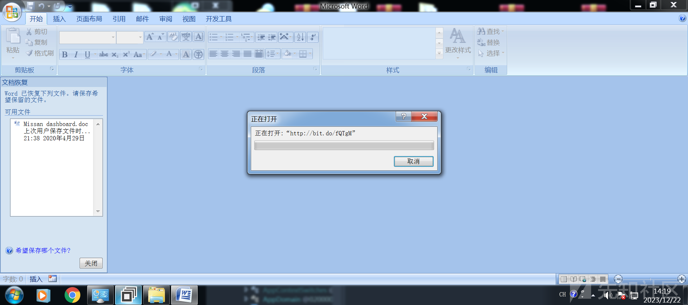](https://xzfile.aliyuncs.com/media/upload/picture/20240126101149-434265dc-bbf0-1.png)  
看到xml格式的office文档首先考虑使用oleid和oleobj对他进行解析(先pip install oletools）

[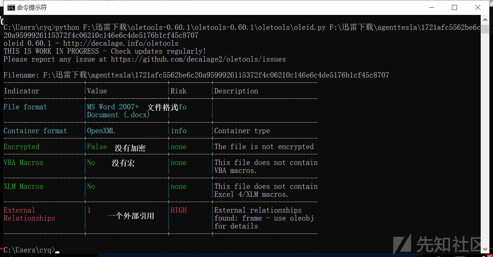](https://xzfile.aliyuncs.com/media/upload/picture/20240126101202-4b17e232-bbf0-1.png)  
使用oleobj提取到外部短链接“[http://bit.do/fQTgM”](http://bit.do/fQTgM%E2%80%9D)

[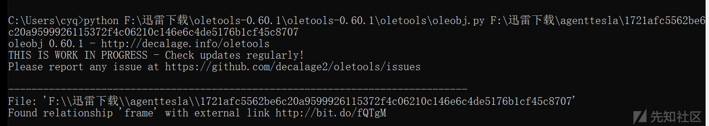](https://xzfile.aliyuncs.com/media/upload/picture/20240130180923-a4280fa4-bf57-1.png)

对于这种短链接，我们使用命令

```plain
$respond=Invoke-WebRequest -Uri 'http://bit.do/fQTgM' -UserAgent "Mozilla/4.0 (compatible; MSIE 7.0; Windows NT 6.1; Win64; x64; 
Trident/7.0; .NET CLR 2.0.50727; SLCC2; .NET CLR 3.5.30729; .NET CLR 
3.0.30729; .NET4.0C; .NET4.0E)"
```

该命令的作用是模拟请求接口，并对接收的数据进行json格式化，并取出其中的属性值

[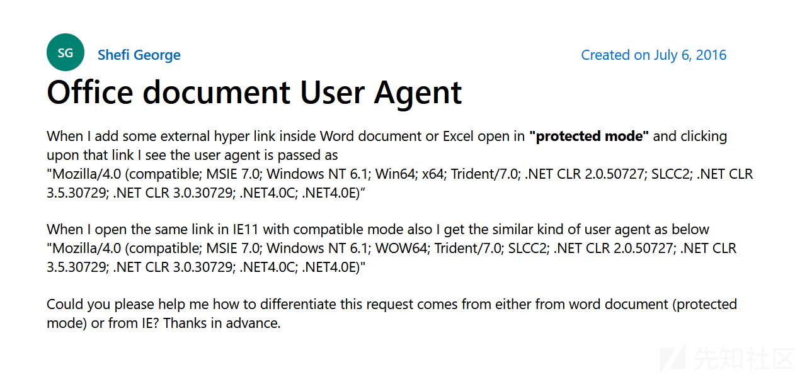](https://xzfile.aliyuncs.com/media/upload/picture/20240130181012-c1cdda7a-bf57-1.png)  
使用networkMiner，从流量包中提取到三个文件

[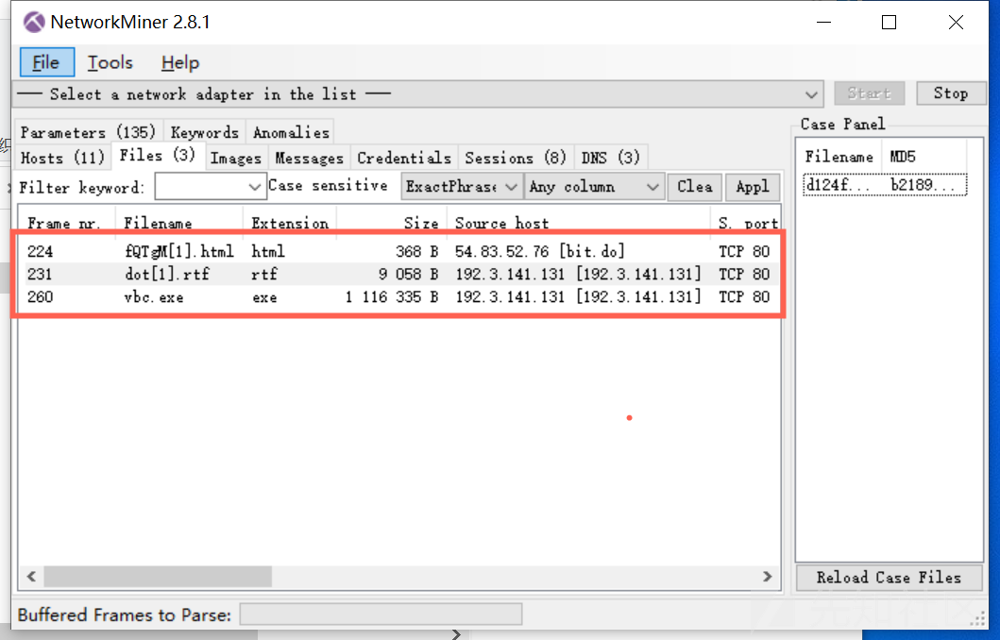](https://xzfile.aliyuncs.com/media/upload/picture/20240130181024-c8b21b26-bf57-1.png)

dot.rtf是一个rtf格式的文档，里面有一些obj数据：

[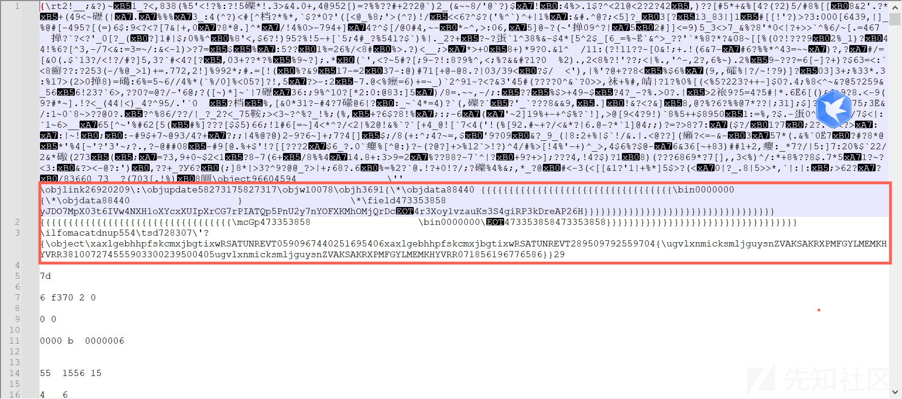](https://xzfile.aliyuncs.com/media/upload/picture/20240130181047-d67b48a4-bf57-1.png)

在使用rtfdump的时候出现了小问题，最开始报右边的错，查阅资料后发现是python版本问题，因为我右边机子使用的是python3，所以怎么都执行不成功，当换成python2后成功执行（如左图）

[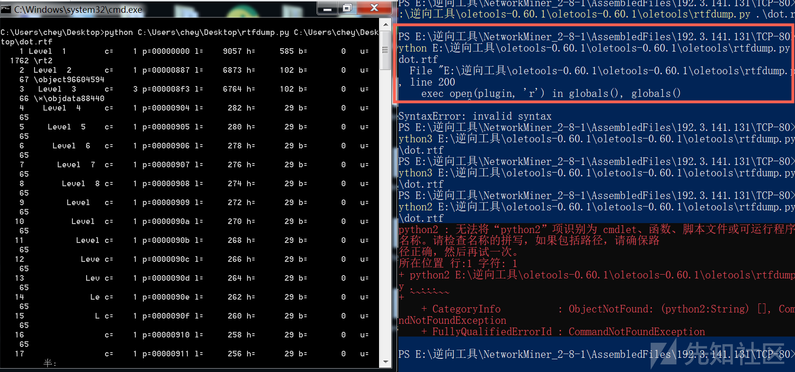](https://xzfile.aliyuncs.com/media/upload/picture/20240130181057-dc48197e-bf57-1.png)  
rtfdump.py .\\dot.rtf -s 1 (查看十六进制数据）  
可以看到他启动了方程式进程执行了一段powershell命令  
EquationEditor通常是一个危险的标志。因为攻击者经常利用CVE-2017-11882来运行特定的shellCode。如果你通过HexView检查第2节中的内容，你可能会发现某些编码模式，即反复出现的字符和符号。这通常是XOR/ROL/SHIFT加密函数的典型行为。为此，Didier Stevens提供了另一个有趣的工具，名为xorsearch。

[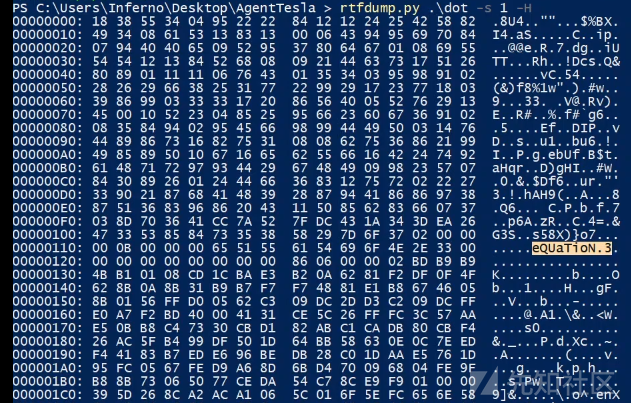](https://xzfile.aliyuncs.com/media/upload/picture/20240130181106-e1eca714-bf57-1.png)  
使用rtfobj提取rtf中的数据

[](https://xzfile.aliyuncs.com/media/upload/picture/20240130181115-e6f1f930-bf57-1.png)  
dump出来两个文件，第一个就是方程式里面的shellcode,第二个是个空文件

[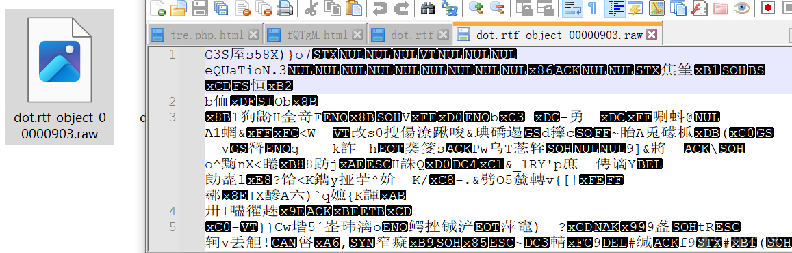](https://xzfile.aliyuncs.com/media/upload/picture/20240130181121-eaa14bc6-bf57-1.png)  
这个rtf文件并不是按照标准格式的rtf文件，直接分析不出来。在使用xorsearch工具之前，我们需要将equationeditor所在节转储到一个外部文件中。xorsearch会提供许多偏移量，如果从这些偏移量处运行shellcode的话，可以避免执行未对齐的指令。  
xorsearch.exe -W .\\dot.raw

[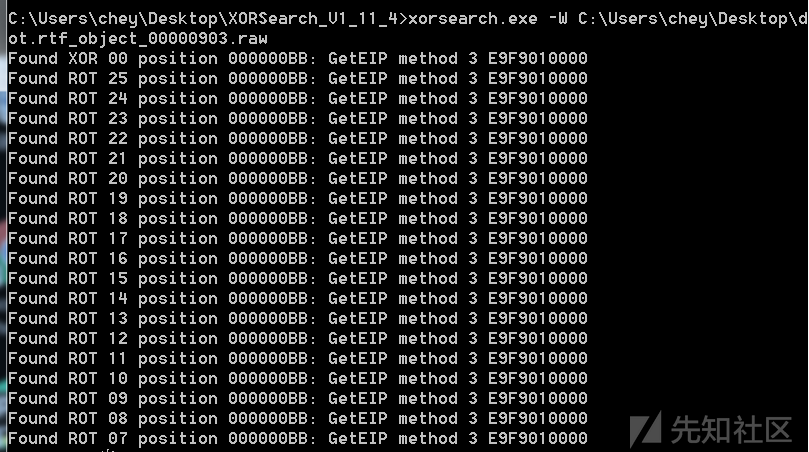](https://xzfile.aliyuncs.com/media/upload/picture/20240130181202-0351c60a-bf58-1.png)  
偏移量是BB，可能是shellcode开始位置的偏移量  
使用010editor打开该文件，找到偏移量bb的位置，前面的内容可以都删掉，就得到了一个纯正的shellcode

[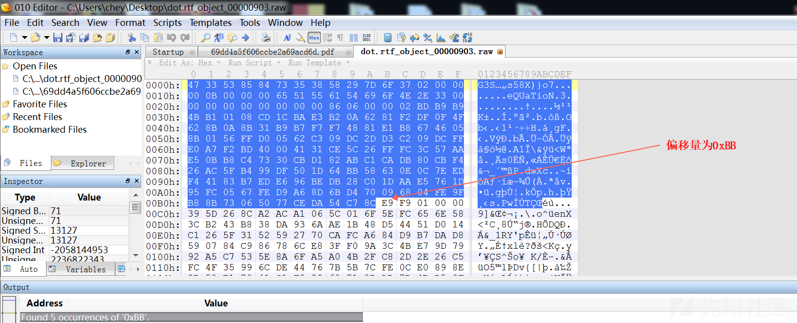](https://xzfile.aliyuncs.com/media/upload/picture/20240130181210-07fe09fc-bf58-1.png)  
使用ida打开该shellcode  
入口处跳转到一个地址：

[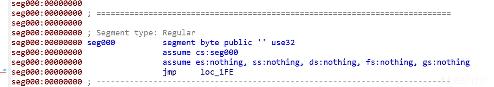](https://xzfile.aliyuncs.com/media/upload/picture/20240130181216-0b84f14e-bf58-1.png)  
该地址会调用一个函数，该函数直接pop ebp，看起来像是在试图寻找自己在内存中的位置：

[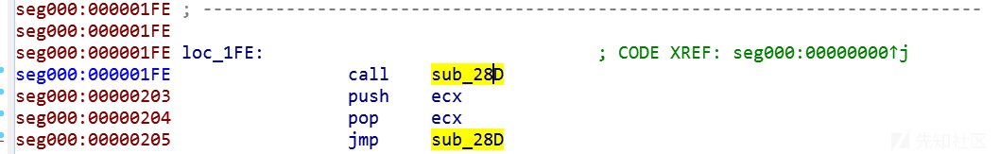](https://xzfile.aliyuncs.com/media/upload/picture/20240130181223-0f9775b8-bf58-1.png)

[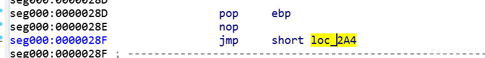](https://xzfile.aliyuncs.com/media/upload/picture/20240130181225-10aba6a4-bf58-1.png)

知识点补充

```plain
在x86体系结构的汇编语言中，call 指令与pop 指令通常用于不同的目的，但它们有时可以一起使用来进行特定的技巧，比如寻找当前代码的内存地址。

call 指令用于调用一个函数。在 call 执行时，它会将下一条指令的地址（返回地址）压入堆栈，并将程序计数器（PC）更新为被调用函数的起始地址。这样当被调用的函数执行完毕后，可以通过栈上的返回地址回到调用它的地方继续执行。
pop 指令用于弹出堆栈顶部的值并将其存储到一个指定的寄存器中。在这种情况，如果 pop 指令紧跟在 call 指令之后，在同一个函数中，这通常是一种技巧，用于获取当前函数的地址。

使用这类技术可以用于构建基于偏移量的引用，例如访问相对于函数位置的数据或者其他资源，尤其常见于生成Shellcode时，因为Shellcode通常需要在不知道确切加载地址的情况下执行。
```

将opcode打开，查看shellcode入口点的位置

[](https://xzfile.aliyuncs.com/media/upload/picture/20240130181254-221bb794-bf58-1.png)

[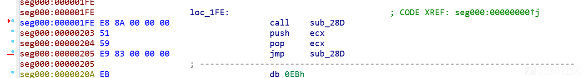](https://xzfile.aliyuncs.com/media/upload/picture/20240130181256-2393ff78-bf58-1.png)  
想要模拟32位的shellcode的时候可以使用另一款号称ShellCode调试专家的软件：scDbg来代替ida寻找shellcode起始地址。运行该软件后需要从xorsearch.exe给出的偏移量处运行模拟器，就本例来说，该偏移量为0x2c74c。在此，建议勾选“Unlimited steps”功能，这样的话，模拟器就能够在不停止shellcode的情况下进行跟踪；同时，我们还建议勾选“Reporting Mode”，这样你就可以在执行结束时看到一个摘要视图。

将shellcode二进制文件放进scdbg，选中FindSc寻找shellcode起始点，点击Launch开始搜索。选择一个地址开始搜索，然后会显示出一些环境字符串、加载库、下载文件等信息。此时很好的确认了偏移量是0x01fe

[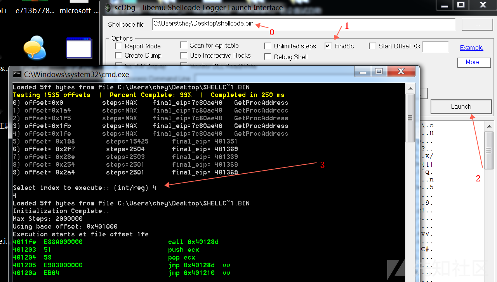](https://xzfile.aliyuncs.com/media/upload/picture/20240130181311-2c12b8ba-bf58-1.png)

[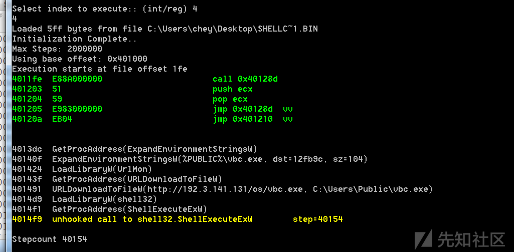](https://xzfile.aliyuncs.com/media/upload/picture/20240130181313-2d493de4-bf58-1.png)  
打开010editor，删除掉0x01fe偏移量前面的信息

[](https://xzfile.aliyuncs.com/media/upload/picture/20240130181318-30a0d0f6-bf58-1.png)  
createdump会模拟shellcode的创建以及对shellcode的所有修改，他会解密一些内容：

[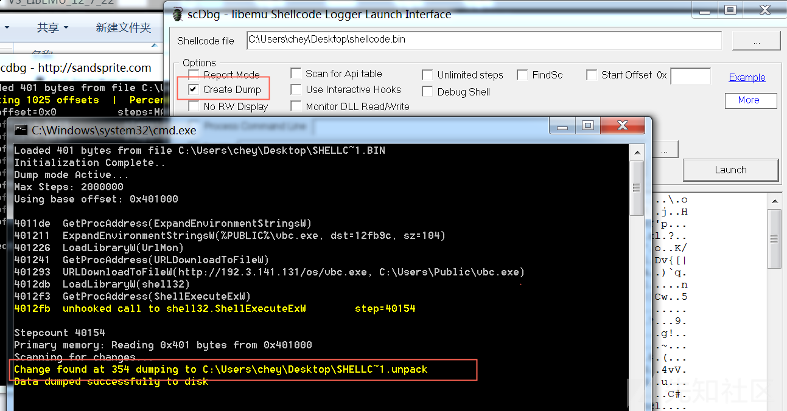](https://xzfile.aliyuncs.com/media/upload/picture/20240130181326-34f92c84-bf58-1.png)  
对ebp的值进行计算会发现他的偏移是0x5：

[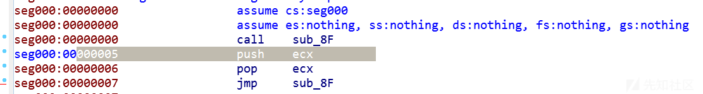](https://xzfile.aliyuncs.com/media/upload/picture/20240130181332-39060482-bf58-1.png)  
加上0x15D=0x162，找到偏移为0x162的位置，这里是在进行解码操作

[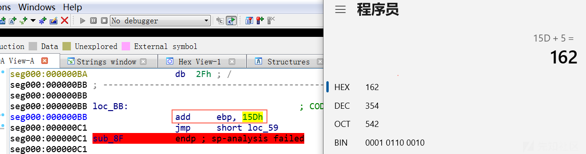](https://xzfile.aliyuncs.com/media/upload/picture/20240130181340-3da2f3b0-bf58-1.png)

[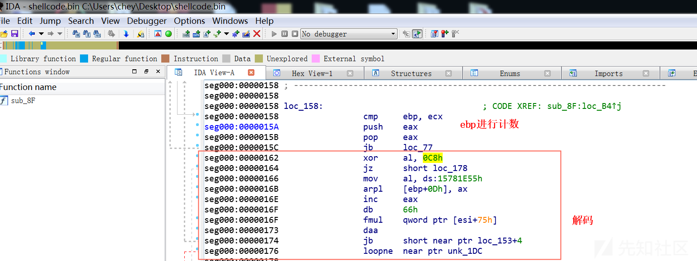](https://xzfile.aliyuncs.com/media/upload/picture/20240130181347-41a5ad7c-bf58-1.png)  
加上0x297，找到偏移为3F9的地址

[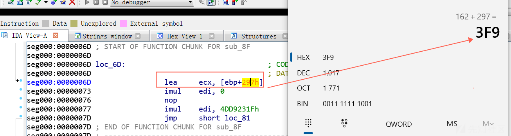](https://xzfile.aliyuncs.com/media/upload/picture/20240130181352-44ac695c-bf58-1.png)  
如果要运行rtf或者office文档，Microsoft office将会支持这些文档使用Equation.exe。gflags.exe可以给这些程序以图像的方式调试。调试方法如下：  
1、运行dot.rtf文件，打开procmon.exe对进程树进行监控

[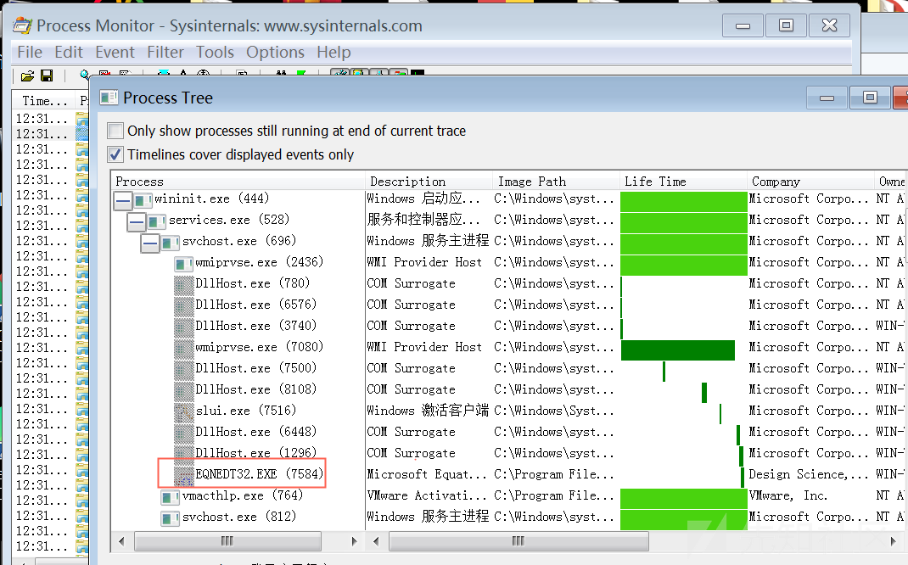](https://xzfile.aliyuncs.com/media/upload/picture/20240130181358-48718dec-bf58-1.png)  
2、将信息填入调试器

[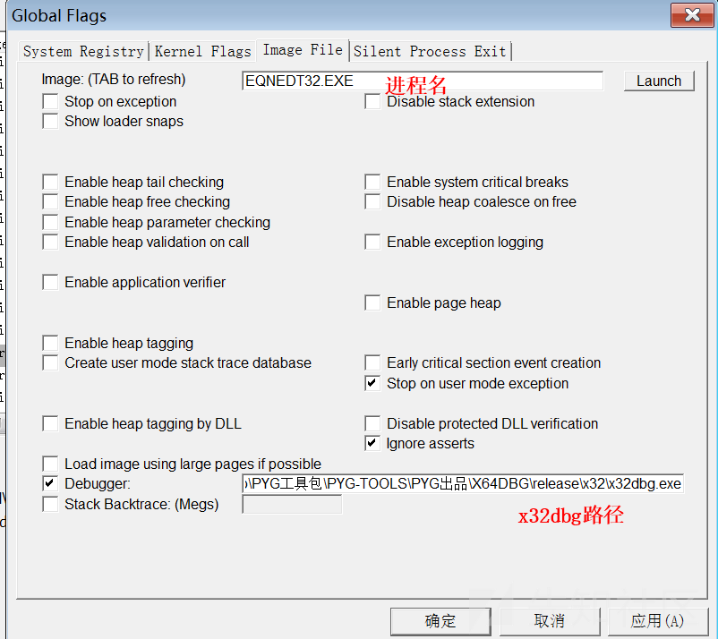](https://xzfile.aliyuncs.com/media/upload/picture/20240130181403-4b6b0adc-bf58-1.png)  
3、将dbg附加到EQNEDT32.exe进行调试  
打开doc.rtf后再打开调试器，触发附加调试断点，程序断下来

[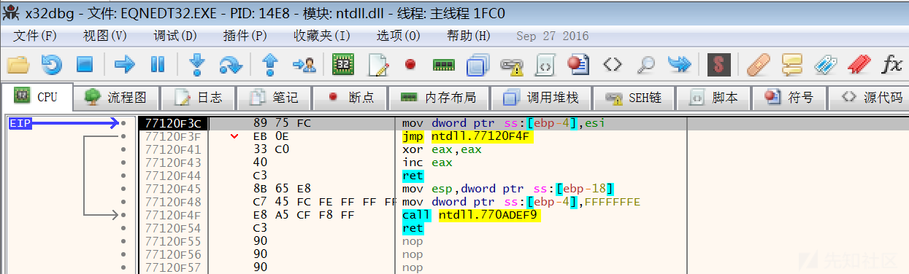](https://xzfile.aliyuncs.com/media/upload/picture/20240130181410-4f6f2938-bf58-1.png)  
因为他会下载文件，所以寻找urlmon.dll这个库文件

[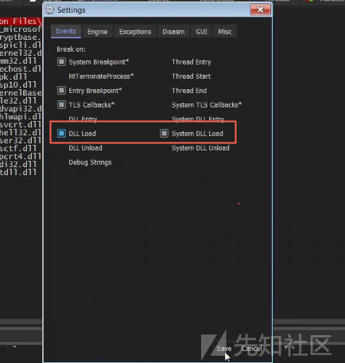](https://xzfile.aliyuncs.com/media/upload/picture/20240130181416-52db3eb8-bf58-1.png)  
就可以动态分析shellcode下载exe的地方了 由于这里我始终断不到这个dll，暂时只记录思路

发现他会下载一个软件vbc.exe

[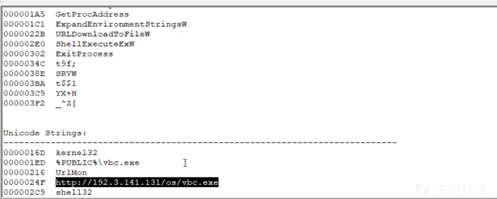](https://xzfile.aliyuncs.com/media/upload/picture/20240130181423-57665f44-bf58-1.png)

vbc.exe  
先使用pestudio、die、exeinfope检查一遍基本信息  
.text和.rsrc区段有加密

[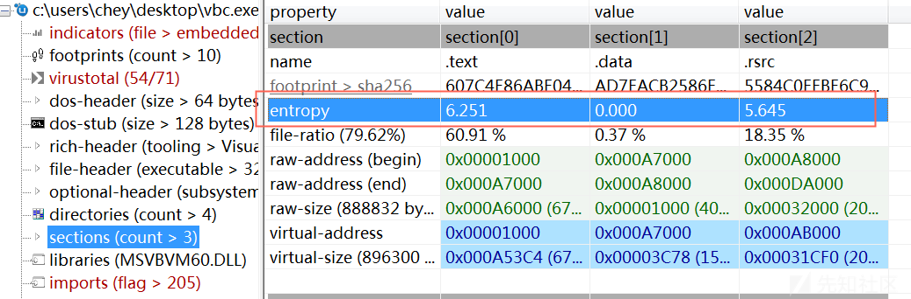](https://xzfile.aliyuncs.com/media/upload/picture/20240130181430-5b921216-bf58-1.png)  
vb写的程序，无壳

[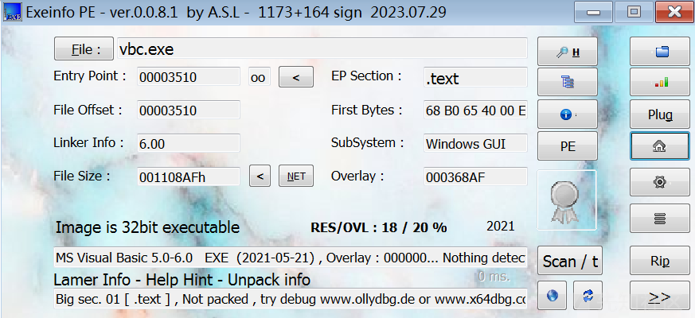](https://xzfile.aliyuncs.com/media/upload/picture/20240130181436-5f1bfd70-bf58-1.png)  
有很多api解密的函数调用

[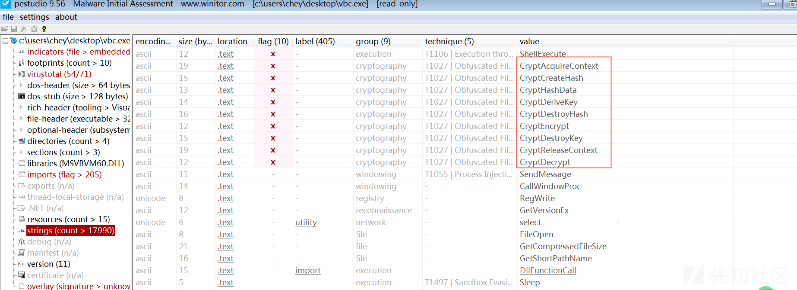](https://xzfile.aliyuncs.com/media/upload/picture/20240130181451-67e546be-bf58-1.png)  
给CryptDecrypt下断点，断下来后直接运行到返回地址，按理说解密的内存地址指针应该在堆栈处，但我划拉了很久才发现这个地址 不懂

[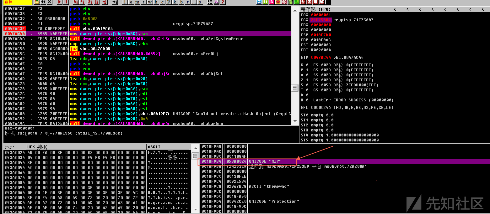](https://xzfile.aliyuncs.com/media/upload/picture/20240130181456-6ace9dc6-bf58-1.png)  
证明vbc.exe是个加载器，目的是从内存中解密并执行payload。把这篇内存空间dump下来  
这篇空间格式有点奇怪 不是标准的pe 查了资料也不知道出了什么问题
