# 内网渗透瑞士军刀-impacket工具解析（七） - 先知社区

内网渗透瑞士军刀-impacket工具解析（七）

- - -

前言  
Atexec是Impacket中被高频使用的一种横向工具，该技术手段主要通过任务计划实现，本文带大家对其中的技术细节进行简单的介绍。  
0x1 MS-TSCH  
Atexec的原理并不复杂，通过远程调用对方主机的任务计划程序（Task Scheduler）创建一个定时任务，然后通过手动触发该定时任务将执行结果写入文本中，再利用smb共享去读取执行结果。  
MS-TSCH：任务调度程序服务远程协议，该协议用于注册和配置任务以及查询远程计算机上运行的任务的状态，主要由三个独立的RPC接口组成  
网络时间表（ATSvc）

任务计划程序代理 ( SASec)

Windows Vista 操作系统任务远程协议 ( ITaskSchedulerService )

这三个接口都使用RPC作为远程配置和管理任务的传输，且它们的功能是逐级递增的。现如今，ITaskSchedulerService 成为了大部分计划任务操作的首选。同时，ITaskSchedulerService 接口不通过远程注册表和文件系统协议，而是通过XML来指定任务的配置。  
该三个接口在Impacket中均有实现  
Atsvc  
在atsvc.py中实现  
接口的UUID：

[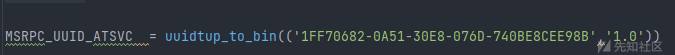](https://xzfile.aliyuncs.com/media/upload/picture/20240131180934-d55fa6f8-c020-1.png)  
相关的增删改查的结构体和请求：

[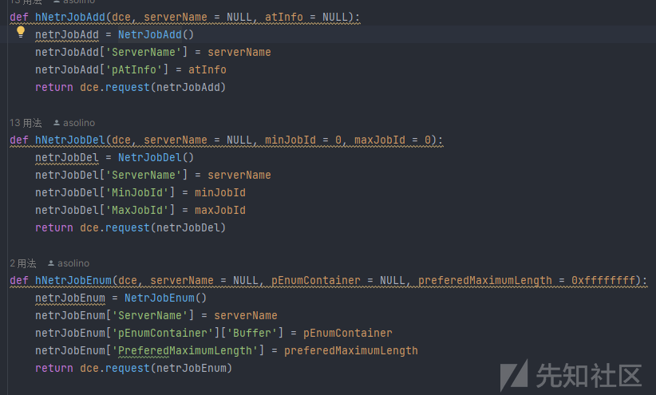](https://xzfile.aliyuncs.com/media/upload/picture/20240131180949-de543918-c020-1.png)  
SASec  
在sasec.py中实现  
接口的UUID和相关的结构体

[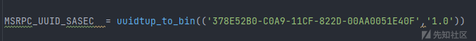](https://xzfile.aliyuncs.com/media/upload/picture/20240131181001-e54c799c-c020-1.png)

[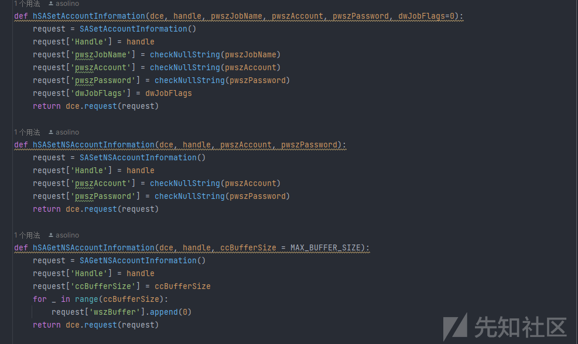](https://xzfile.aliyuncs.com/media/upload/picture/20240131181011-eb927996-c020-1.png)  
ITaskSchedulerService  
在tsch.py中实现  
这是平时红队工具中最常用也是功能最完善的计划任务接口，Atexec中默认的也是这个接口

[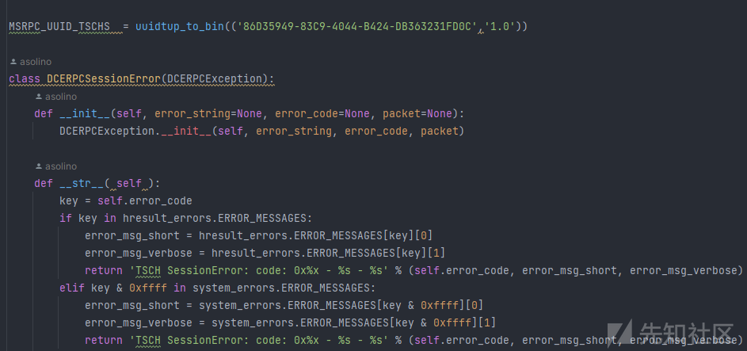](https://xzfile.aliyuncs.com/media/upload/picture/20240131181022-f218a3b2-c020-1.png)  
0x2 流程分析  
首先从主函数入口开始运行，打印版本和banner信息，利用argparse库解析输入的参数。中间经过一系列的参数解析和日志DEBUG判断，最后来到最后两个最关键的函数

[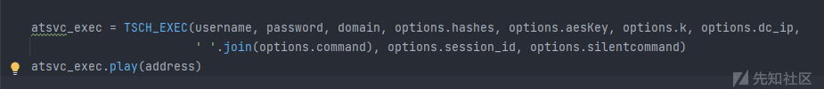](https://xzfile.aliyuncs.com/media/upload/picture/20240131181043-fe746b5a-c020-1.png)

第一个函数用于初始化定义的TSCH\_EXEC类对象，第二个调用实例的play方法，我们来到这个类对象的play方法，  
首先格式化连接参数，使用SMB传输的RPC服务通过连接命名管道\\pipe\\atsvc来创建和删除计划任务，然后利用DCERPCTransportFactory工厂来实例一个rpctransport

[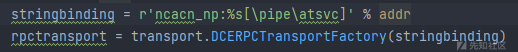](https://xzfile.aliyuncs.com/media/upload/picture/20240131181058-07a3f4e8-c021-1.png)

[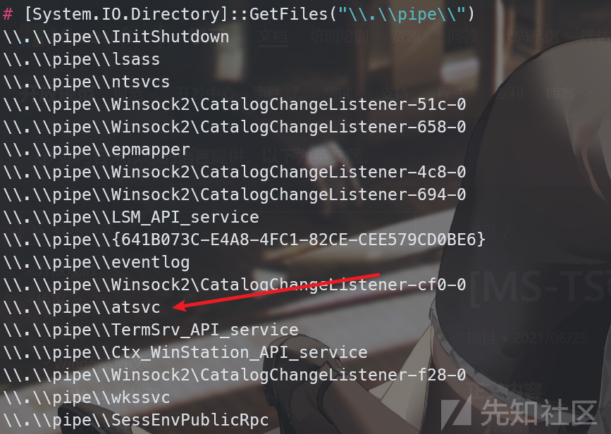](https://xzfile.aliyuncs.com/media/upload/picture/20240131181110-0e4eb904-c021-1.png)

然后根据凭据的种类来设置凭据，进入doStuff方法。在doStuff方法中，获取了一个dce对象，并绑定相应的UUID接口，也就是ITaskSchedulerService 接口。随机生成一个文件名并将这个文件名与tmp拼接作为临时文件，将后续执行结果写入，同时这个临时文件名也将作为后续创建的计划任务名。  
读取我们输入的命令并拼接，可以看到利用cmd执行结果，并写入Temp目录下的临时文件中

[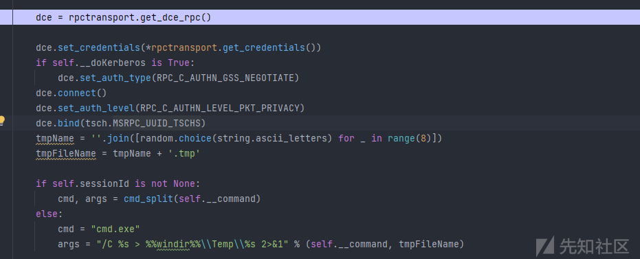](https://xzfile.aliyuncs.com/media/upload/picture/20240131181123-16540906-c021-1.png)

后面定义的xml则是创建的计划任务的具体配置，我们主要关注它的触发器和执行的命令  
触发器：

[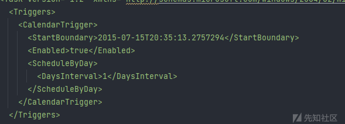](https://xzfile.aliyuncs.com/media/upload/picture/20240131181136-1e494932-c021-1.png)

它指定了起始时间，从2015年7月15号开始每隔一天来周期性的触发这个任务  
执行命令：

[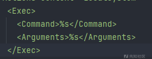](https://xzfile.aliyuncs.com/media/upload/picture/20240131181203-2e4dc9c0-c021-1.png)

第一个参数是执行的命令，第二个参数是给命令的参数

[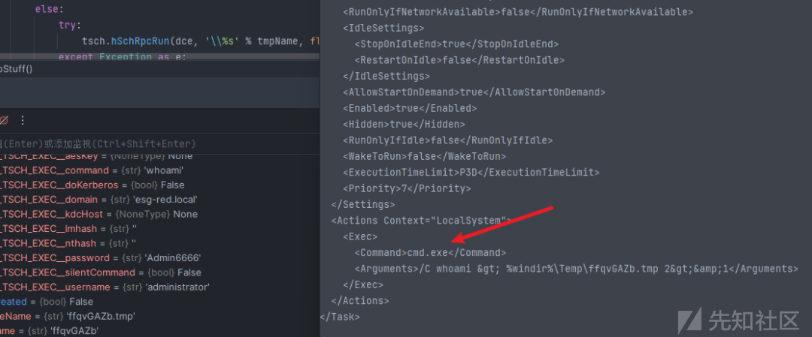](https://xzfile.aliyuncs.com/media/upload/picture/20240131181215-355d6b08-c021-1.png)

后续利用hSchRpcRegisterTask来注册计划任务同时打印日志输出

[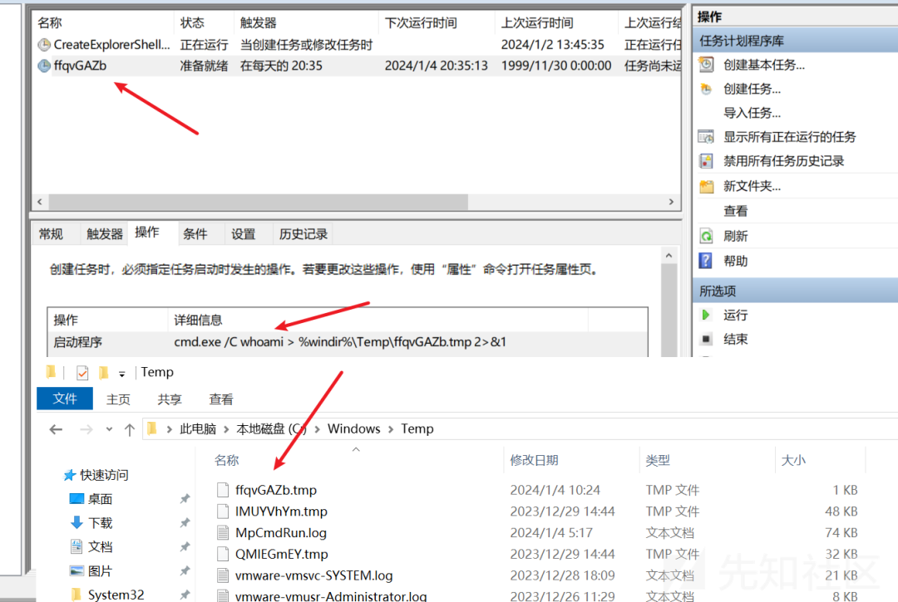](https://xzfile.aliyuncs.com/media/upload/picture/20240131181229-3d93e2c0-c021-1.png)  
前面我们知道，设置的触发器是每天一次的执行，这并不符合我们的需求，于是后续利用hSchRpcRun来直接进行触发

[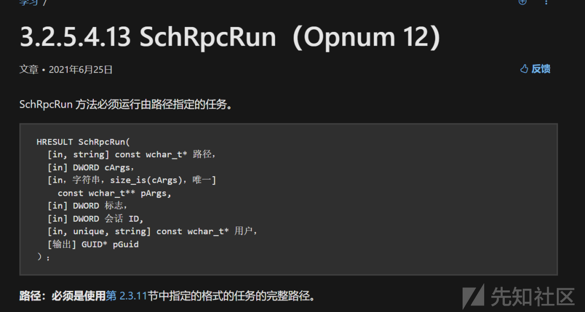](https://xzfile.aliyuncs.com/media/upload/picture/20240131181351-6e7125c4-c021-1.png)  
后续就是很常规的利用hSchRpcGetLastRunInfo获取计划任务的详细信息，利用hSchRpcDelete删除执行之后的计划任务，然后进行一次SMB连接读取输出的结果，在读取成功之后删除临时tmp文件

[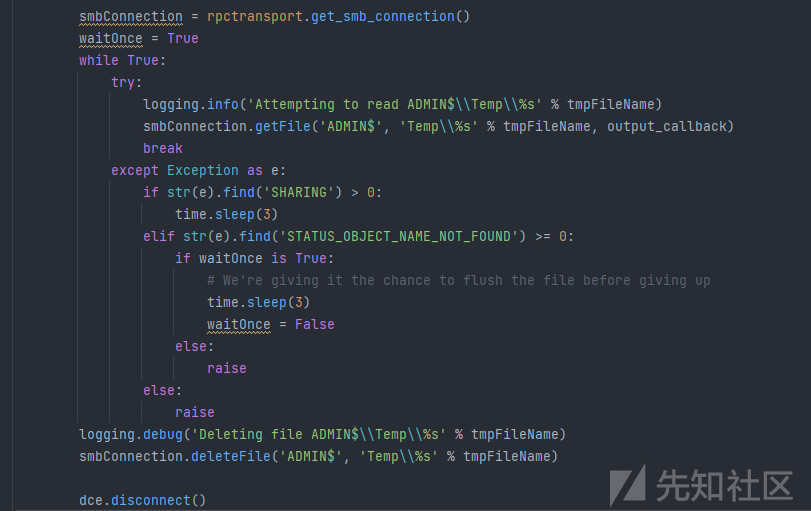](https://xzfile.aliyuncs.com/media/upload/picture/20240131181336-654f0cd6-c021-1.png)

最后整个脚本的流程结束  
0x3 总结  
Atexec通过创建计划任务来巧妙的执行命令，但相较于Impacket中的其他的命令执行工具，它也有很多不足。例如它不能获取一个交互式的shell只能单步执行命令。同时后面文件逻辑处理也有些许不足，如果计划任务中间过程出现问题，生成的结果文件则不会被删除，如下：

[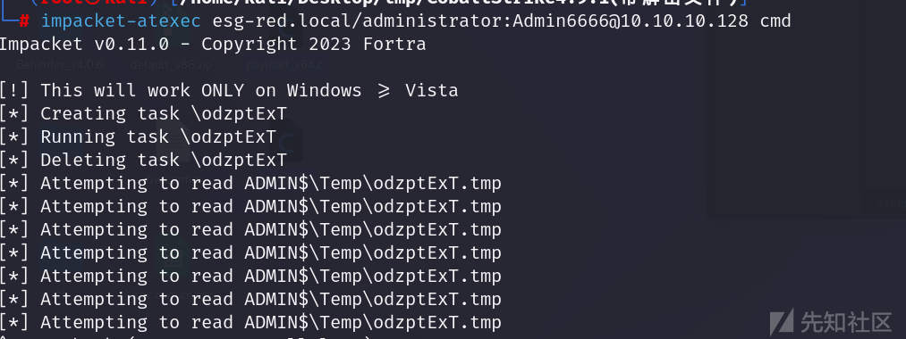](https://xzfile.aliyuncs.com/media/upload/picture/20240131181320-5bfd2afa-c021-1.png)

[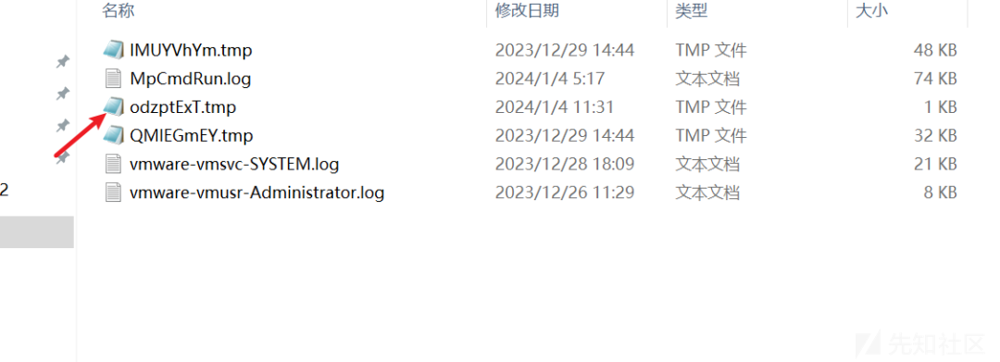](https://xzfile.aliyuncs.com/media/upload/picture/20240131181302-515cb278-c021-1.png)

除此之外，远程创建计划任务本身也是一个比较敏感的操作，很容易被杀软监控或者阻拦。我们可以通过其他方法来创建计划任务，例如通过COM组件等。
