# 域渗透实战之blackfield - 先知社区

域渗透实战之blackfield

- - -

# 信息收集

## 端口扫描

使用nmap去扫描端口，发现存在大量端口。

```plain
端口 53 已开放，并通过 TCP 托管 DNS 服务 – 版本：Simple DNS Plus（目前版本号未知）
端口 88 已打开并托管 kerberos 服务。
端口 135 / 445 已打开，分别托管 RPC / SMB 共享服务。
端口 389 / 3268 已打开并托管 LDAP 服务。
端口 593 已开放并通过 HTTP 托管 RPC 服务。
端口 5985 托管 WinRM 服务、
```

[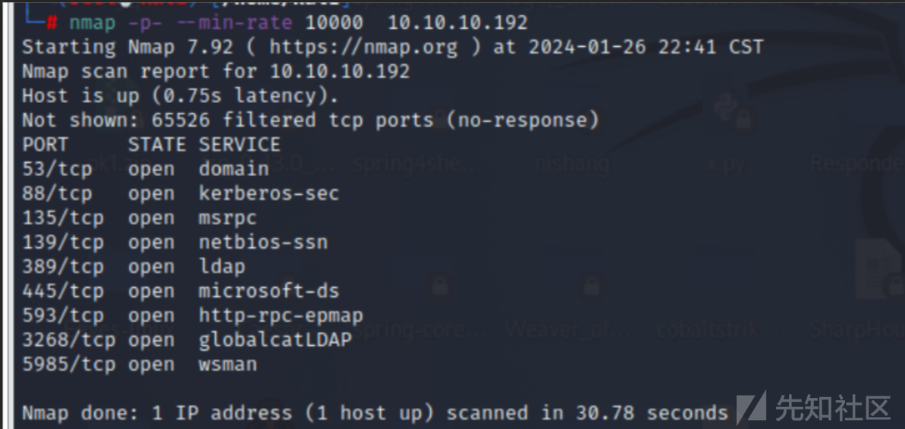](https://xzfile.aliyuncs.com/media/upload/picture/20240129102129-1c3f9e96-be4d-1.png)

接着去探测端口所对应的服务。

[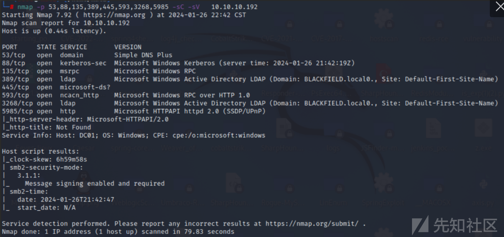](https://xzfile.aliyuncs.com/media/upload/picture/20240129102141-238dda32-be4d-1.png)

## DNS - TCP/UDP 53

尝试针对 DNS 服务运行区域传输。

[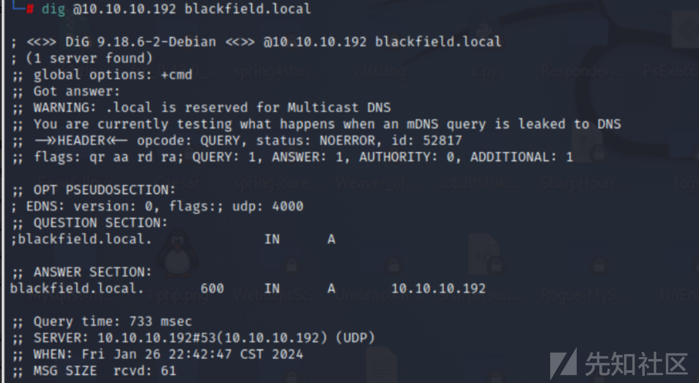](https://xzfile.aliyuncs.com/media/upload/picture/20240129102155-2c3dd42a-be4d-1.png)

区域传输尝试失败。

[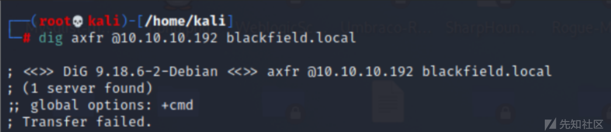](https://xzfile.aliyuncs.com/media/upload/picture/20240129102204-3185746a-be4d-1.png)

## LDAP - TCP 389 / 3268

尝试LDAP搜索。

[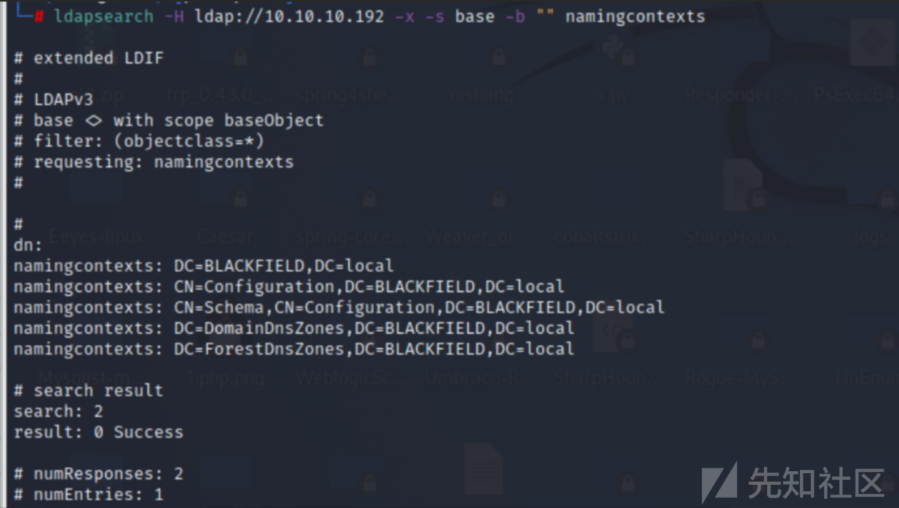](https://xzfile.aliyuncs.com/media/upload/picture/20240129102215-37a3f5ec-be4d-1.png)

发现DomainDnsZones.blackfield.local 和 ForestDnsZones.blackfield.local 这2个子域名。

[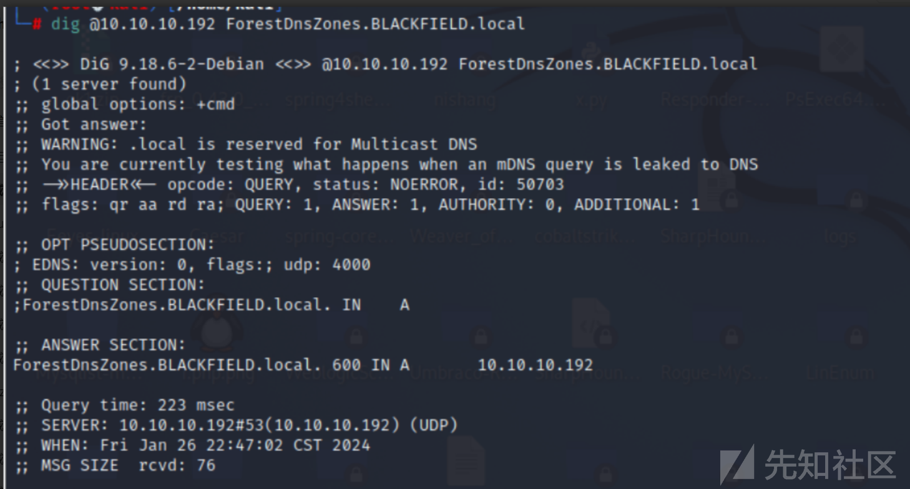](https://xzfile.aliyuncs.com/media/upload/picture/20240129102223-3ce7001c-be4d-1.png)

继续尝试使用ldapsearch来获取信息，未发现有可用信息。

[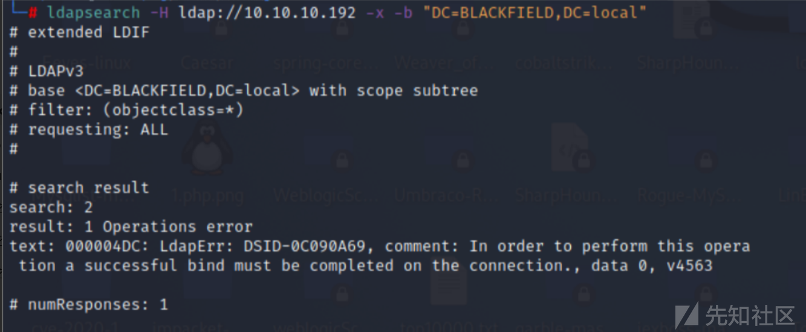](https://xzfile.aliyuncs.com/media/upload/picture/20240129102232-41c2ebf0-be4d-1.png)

## SMB未授权访问

使用crackmapexec来尝试SMB访问

[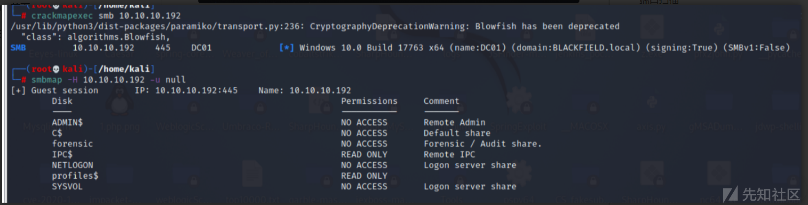](https://xzfile.aliyuncs.com/media/upload/picture/20240129102242-47f283fa-be4d-1.png)

## Null连接

我使用rpcclient和smbclient测试了 NULL 访问，发现我能够访问这两个服务。使用 rpcclient，我发现我可以运行的命令受到限制，而使用 smbclient，能够列出计算机上的所有共享。

[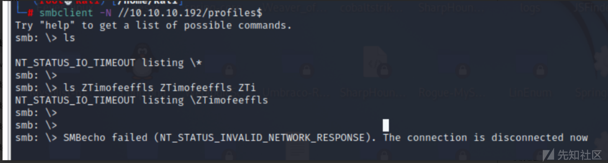](https://xzfile.aliyuncs.com/media/upload/picture/20240129102323-603e44ee-be4d-1.png)

尝试安装共享来进行访问。

[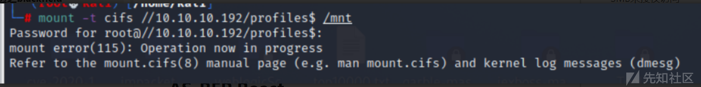](https://xzfile.aliyuncs.com/media/upload/picture/20240129102330-647d8f92-be4d-1.png)

# 漏洞利用

AS-REP Roast  
用来GetNPUsers.py测试用户，将包含一个哈希值krb5asrep，所以我将对其进行 grep 以查看任何成功的结果。

[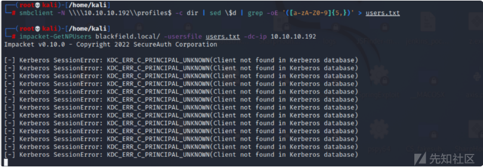](https://xzfile.aliyuncs.com/media/upload/picture/20240129102338-69afae78-be4d-1.png)

## 破解哈希

使用hashcat来破解hash。

[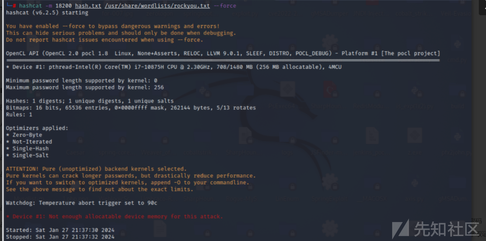](https://xzfile.aliyuncs.com/media/upload/picture/20240129102459-9974ff3c-be4d-1.png)

## 用户检查

使用crackmapexec来检查用户的可用性。

[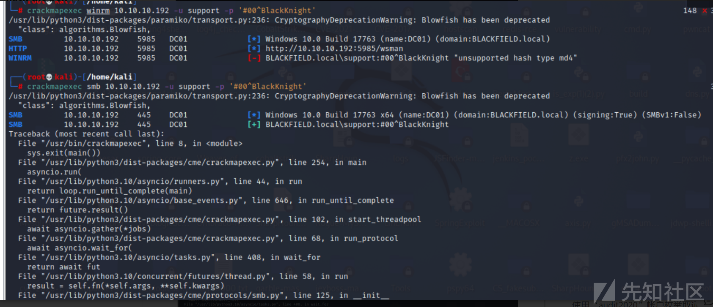](https://xzfile.aliyuncs.com/media/upload/picture/20240129102507-9ea9d126-be4d-1.png)

使用smbmap来查看用户的权限。

[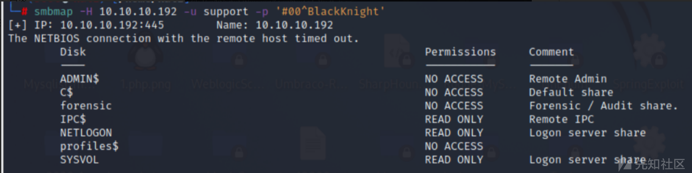](https://xzfile.aliyuncs.com/media/upload/picture/20240129102516-a40802f0-be4d-1.png)

[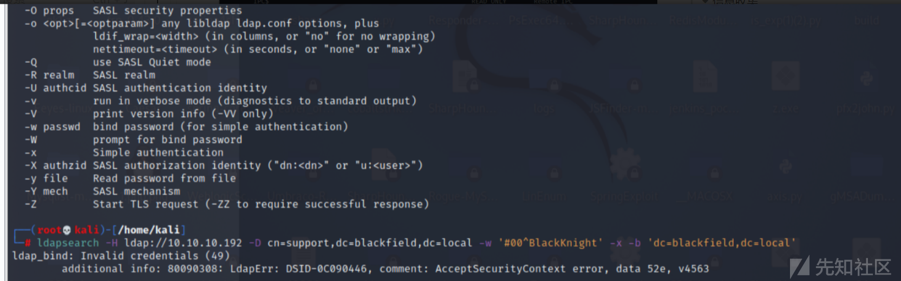](https://xzfile.aliyuncs.com/media/upload/picture/20240129102525-a909e4d0-be4d-1.png)

## LDAP

对 LDAP 进行身份验证

[](https://xzfile.aliyuncs.com/media/upload/picture/20240129102535-af64d466-be4d-1.png)

## Kerberos

尝试了 Kerberoast，但没有返回任何票证

[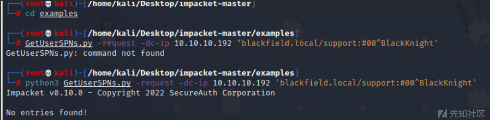](https://xzfile.aliyuncs.com/media/upload/picture/20240129102544-b4c30144-be4d-1.png)

# 权限提升

## BloodHound

```plain
● -c ALL- 所有收集方式
● -u support -p #00^BlackKnight- 用于验证的用户名和密码
● -d blackfield.local- 域名
● -dc dc01.blackfield.local- DC名称（它不会让你在这里使用IP）
● -ns 10.10.10.192- 使用10.10.10.192作为DNS服务器
```

[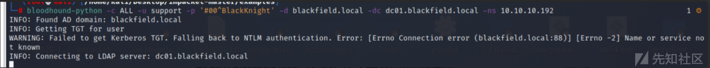](https://xzfile.aliyuncs.com/media/upload/picture/20240129102559-bd6d6fb4-be4d-1.png)

## 分析

将所有文件加载到 Bloodhound 中。在左上角，我搜索了支持，并检查了节点信息。“一级对象控制”下列出了一项：  
进入 Bloodhound 仪表板后，我将四个 JSON 文件上传到 UI 中。

[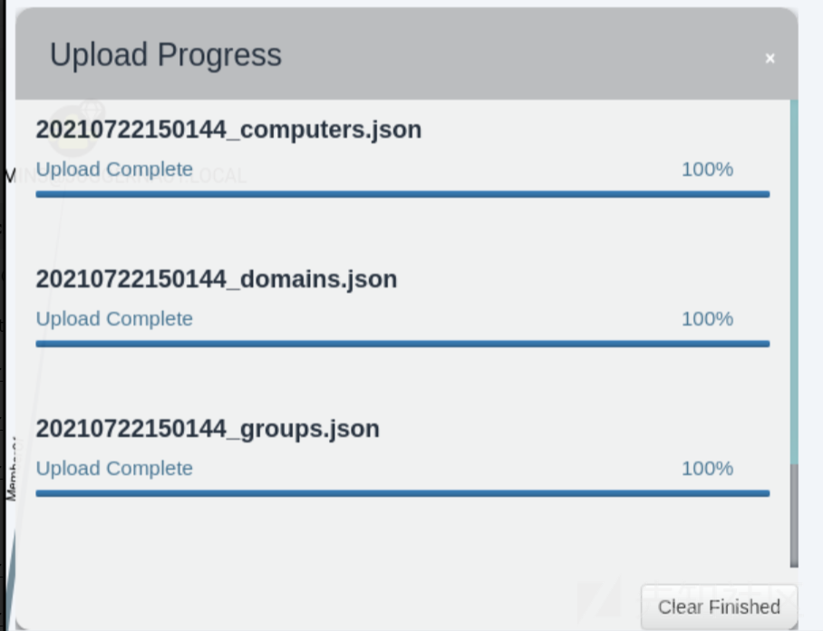](https://xzfile.aliyuncs.com/media/upload/picture/20240129102638-d4e0bac0-be4d-1.png)

检查此选项卡时，在出站控制权限 > 一级对象控制下，发现当前用户有一个特别有趣的权限。“support”帐户能够更改audit2020帐户的密码。

[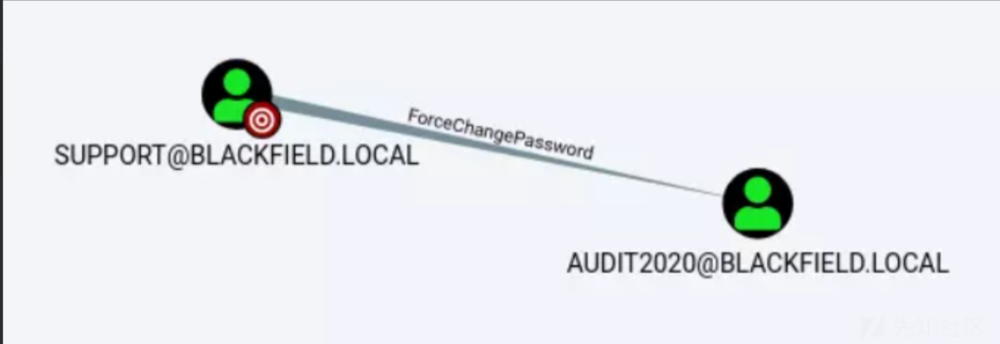](https://xzfile.aliyuncs.com/media/upload/picture/20240129102646-d9289b66-be4d-1.png)

## 更改“audit2020”帐户的密码

使用rpcclient通过 RPC 来完成此操作。

[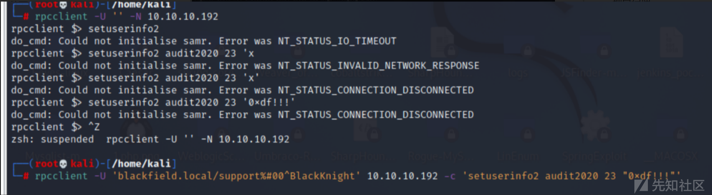](https://xzfile.aliyuncs.com/media/upload/picture/20240129102654-de15015a-be4d-1.png)

先使用 clangmapexec 和以下命令确认密码更改是否成功：

[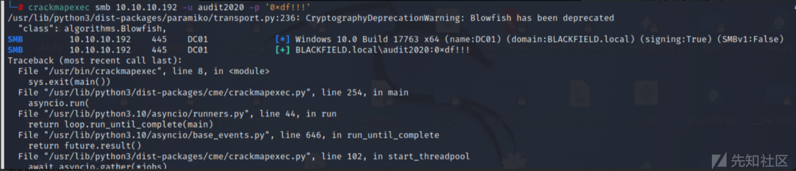](https://xzfile.aliyuncs.com/media/upload/picture/20240129102757-03932db2-be4e-1.png)

## 使用“audit2020”帐户枚举取证共享

[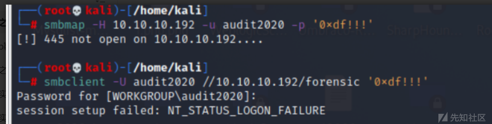](https://xzfile.aliyuncs.com/media/upload/picture/20240129102736-f78ab364-be4d-1.png)

使用crackmapexec 检查帐户是否有权访问取证共享来测试访问权限。

[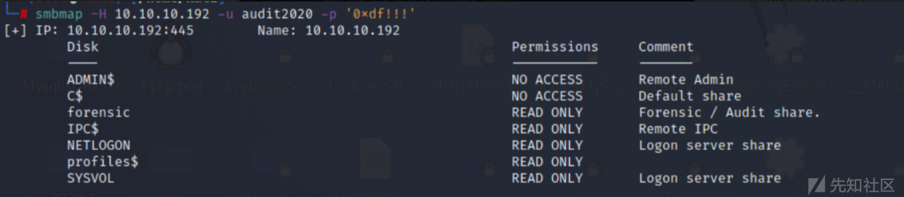](https://xzfile.aliyuncs.com/media/upload/picture/20240129102805-0862ab1a-be4e-1.png)

列出所有文件

[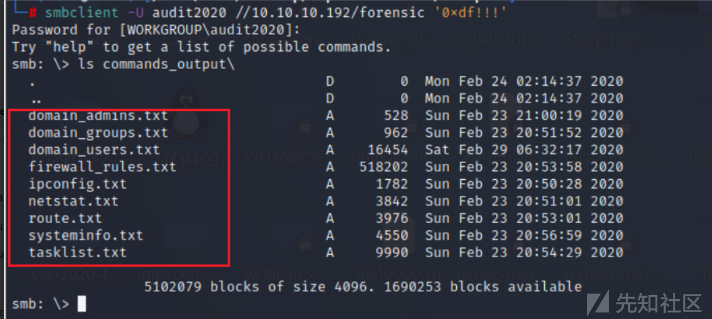](https://xzfile.aliyuncs.com/media/upload/picture/20240129102846-20bc06e8-be4e-1.png)

列出tools下的文件

[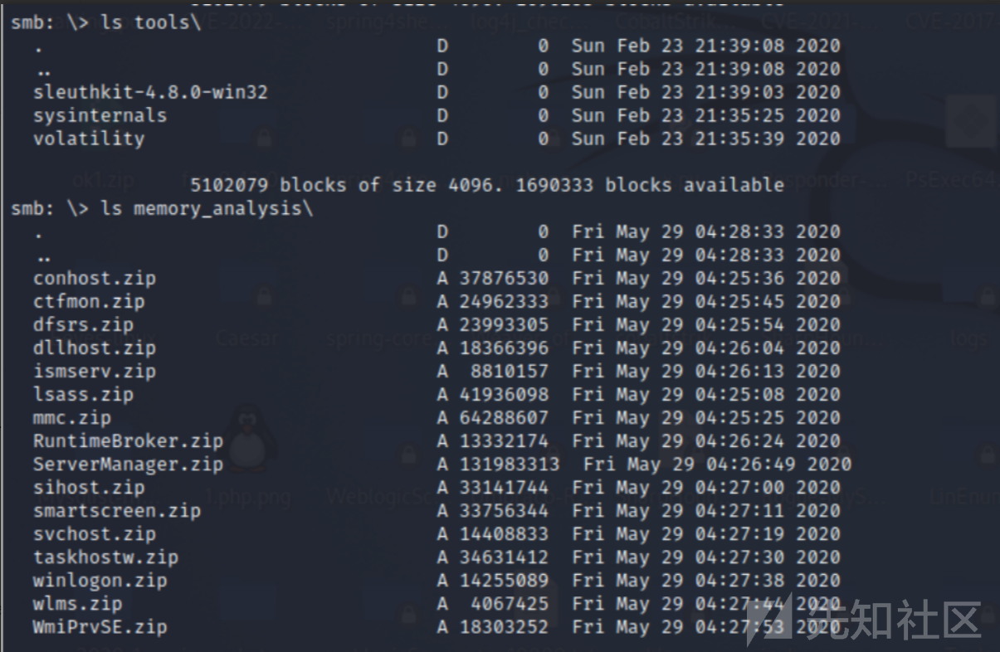](https://xzfile.aliyuncs.com/media/upload/picture/20240129102856-26e4deaa-be4e-1.png)

接着进入memory\_analysis目录，使用get命令下载了lsass.zip文件，然后将其解压缩。

[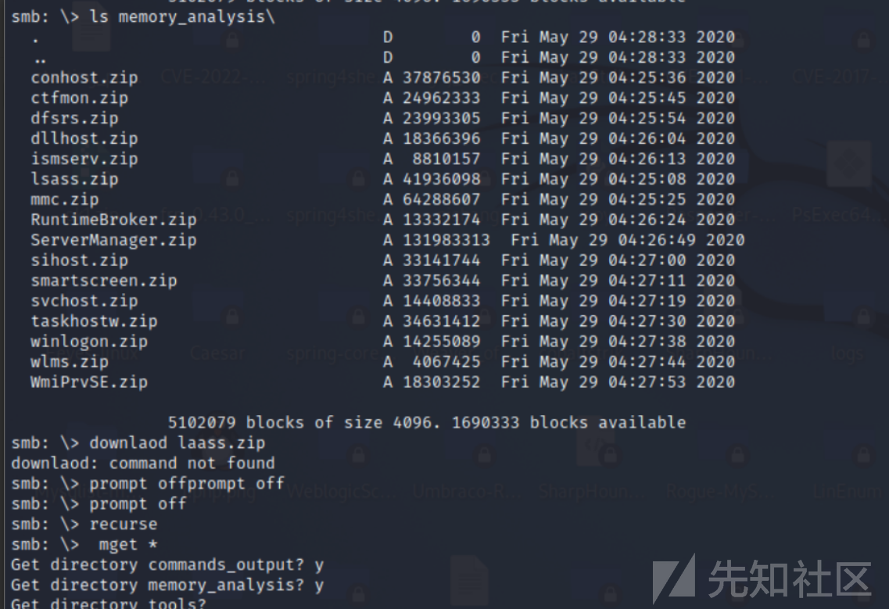](https://xzfile.aliyuncs.com/media/upload/picture/20240129102905-2c819df8-be4e-1.png)

尝试解压lsass.zip

[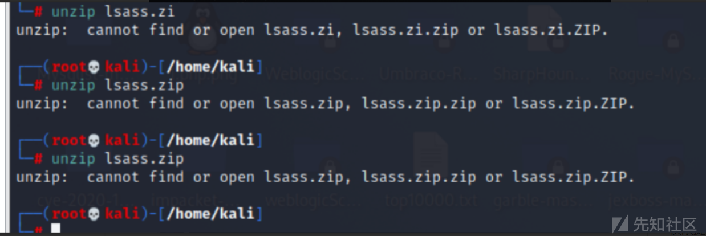](https://xzfile.aliyuncs.com/media/upload/picture/20240129102913-3121e480-be4e-1.png)

用pypykatz和以下命令从攻击者计算机本地的 DMP 文件中提取哈希值

[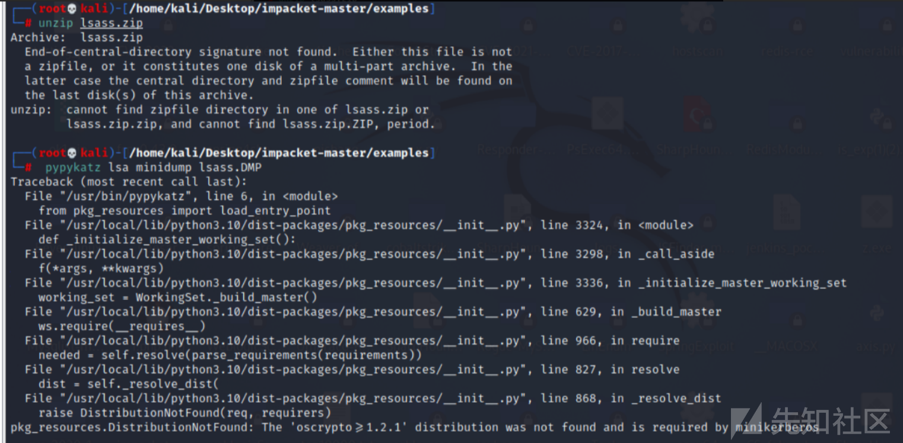](https://xzfile.aliyuncs.com/media/upload/picture/20240129102922-363b9768-be4e-1.png)

提取svc\_backup帐户的 NTLM 哈希值，然后验证用户的可用性。

[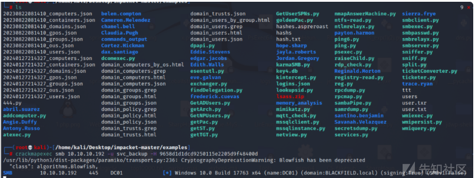](https://xzfile.aliyuncs.com/media/upload/picture/20240129102928-3a46ff32-be4e-1.png)

## WinRM 登录

使用winrm进行登录，并获取user.txt

[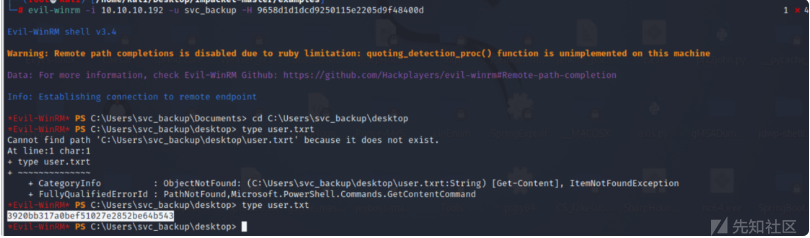](https://xzfile.aliyuncs.com/media/upload/picture/20240129103007-51460688-be4e-1.png)

## 使用“svc\_backup”帐户进行枚举

使用whoami /priv来查看用户权限。

[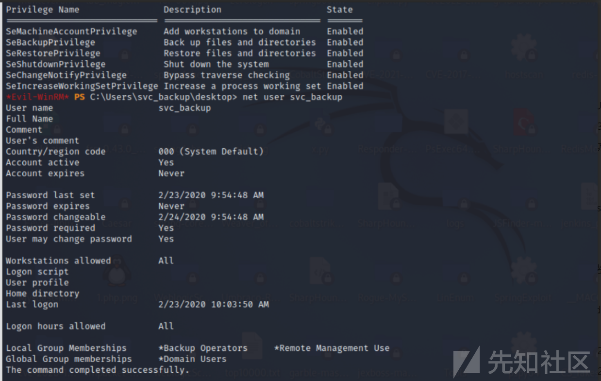](https://xzfile.aliyuncs.com/media/upload/picture/20240129103216-9de14052-be4e-1.png)

## 使用 SeBackupPrivilege 转储本地 SAM 哈希值

复制 SAM 和 SYSTEM到当前路径

[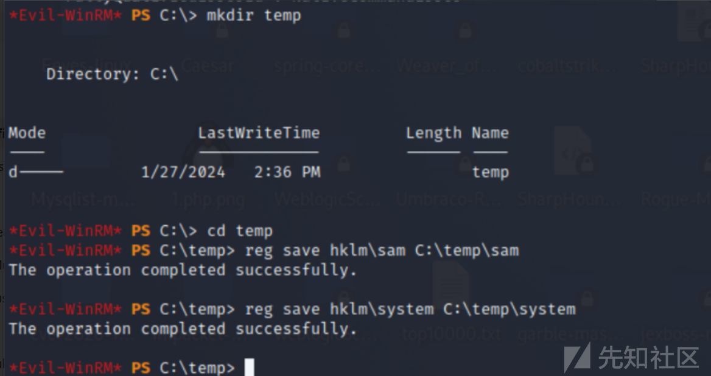](https://xzfile.aliyuncs.com/media/upload/picture/20240129103223-a258238a-be4e-1.png)

## 使用 SeBackupPrivilege 转储 NTDS.dit 哈希值

使用robocopy制作 ntds.dit 文件的副本

[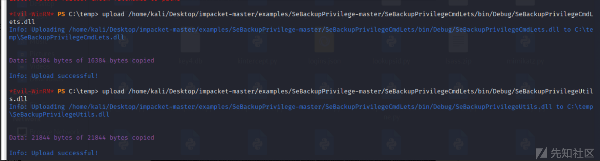](https://xzfile.aliyuncs.com/media/upload/picture/20240129103231-a6cf9e52-be4e-1.png)

制作 script.txt 文件

[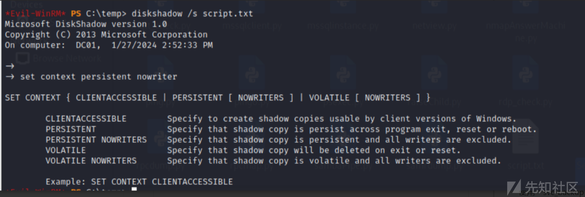](https://xzfile.aliyuncs.com/media/upload/picture/20240129103237-aae3fb64-be4e-1.png)

```plain
echo "set context persistent nowriters" | out-file ./diskshadow.txt -encoding ascii
echo "add volume c: alias temp" | out-file ./diskshadow.txt -encoding ascii -append
echo "create" | out-file ./diskshadow.txt -encoding ascii -append        
echo "expose %temp% z:" | out-file ./diskshadow.txt -encoding ascii -append
```

创建 script.txt 文件后，我使用以下命令创建卷影副本并将其显示为 Z:\\ 驱动器：

[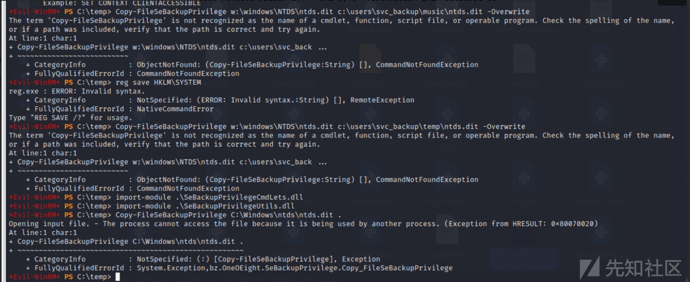](https://xzfile.aliyuncs.com/media/upload/picture/20240129103245-af39cb1c-be4e-1.png)

将备份 ntds.dit 文件移动到我的临时文件夹

```plain
cd Z:
cd windows
cd ntds
robocopy /b .\ C:\temp NTDS.dit
```

[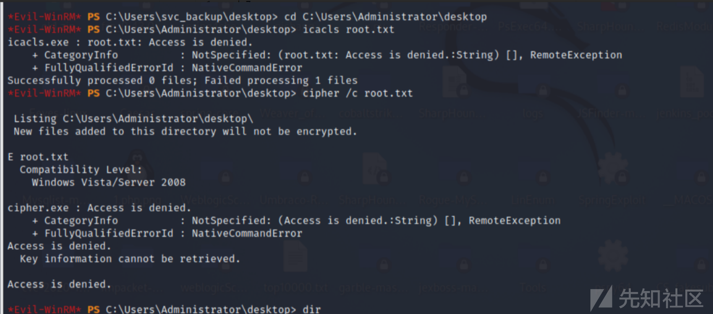](https://xzfile.aliyuncs.com/media/upload/picture/20240129103409-e19d9930-be4e-1.png)

获取 ntds.dit 文件后，从注册表中获取 SYSTEM 文件

[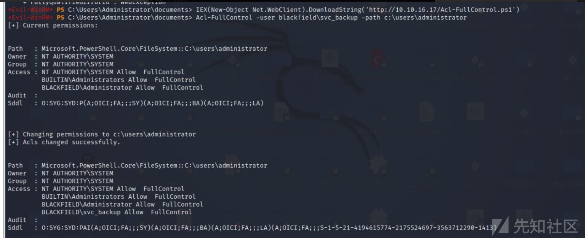](https://xzfile.aliyuncs.com/media/upload/picture/20240129103417-e67b4ac4-be4e-1.png)

## 通过哈希传递攻击获取 Shell

crackmapexec winrm 10.10.10.192 -u svc\_backup -H 9658d1d1dcd9250115e2205d9f48400d

[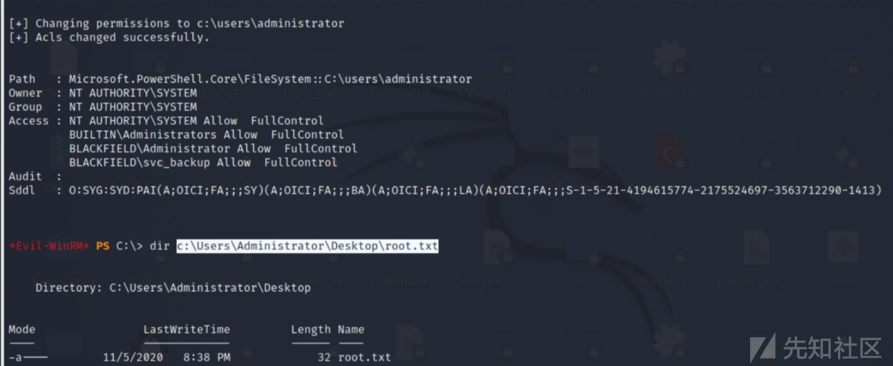](https://xzfile.aliyuncs.com/media/upload/picture/20240129103427-ec2d26b8-be4e-1.png)

## 获取root.txt

成功获取shell，并获得root.txt

[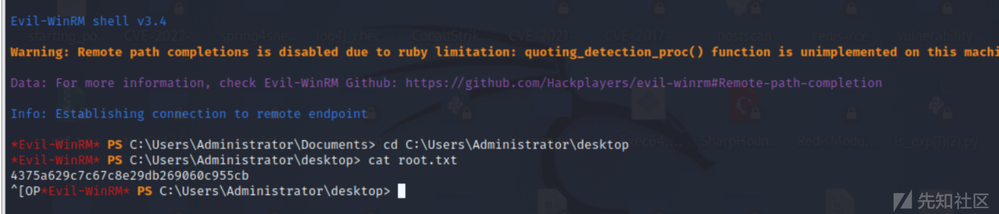](https://xzfile.aliyuncs.com/media/upload/picture/20240129103434-f04cde64-be4e-1.png)

# 总结

此台机器为域渗透类型，内容很多，希望感兴趣的师傅可用去尝试下。步骤: samba获取文件 > 获取用户列表 > 枚举用户得到TGT > hashcat解密TGT > rpcclient枚举权限 > SeBackupPrivilege和SeRestorePrivilege权限修改用户密码 > 重回samba枚举文件 > lsass.DMP密码提取 > 得到普通账户，evil-winrm获取shell > SeBackupPrivilegeCmdLets.dll和SeBackupPrivilegeUtils.dll模块提权系列 > 得到ntds.dit数据库文件 > secretsdump.py解密数据库 > evil-winrm获取administrator shell .
