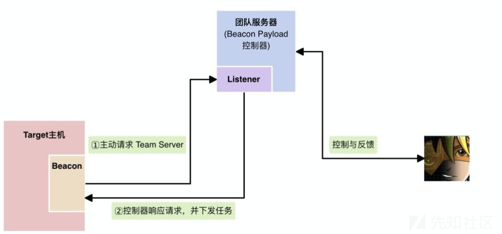
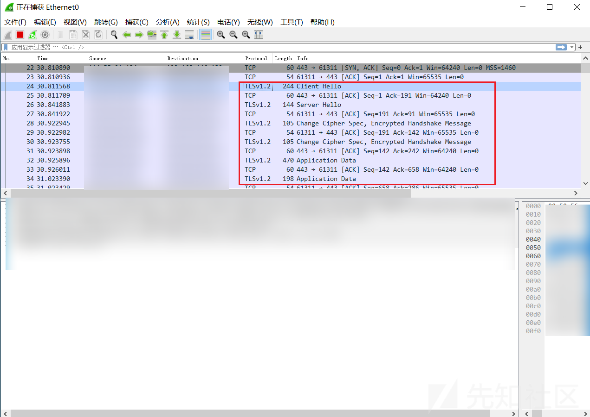
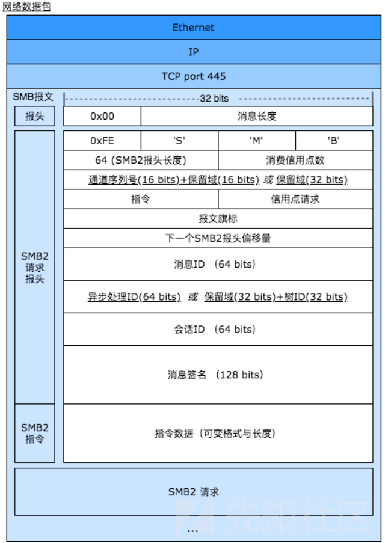
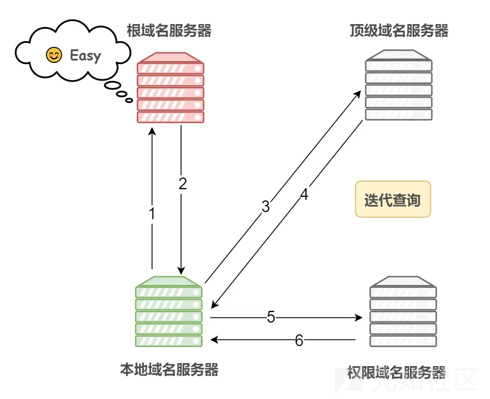
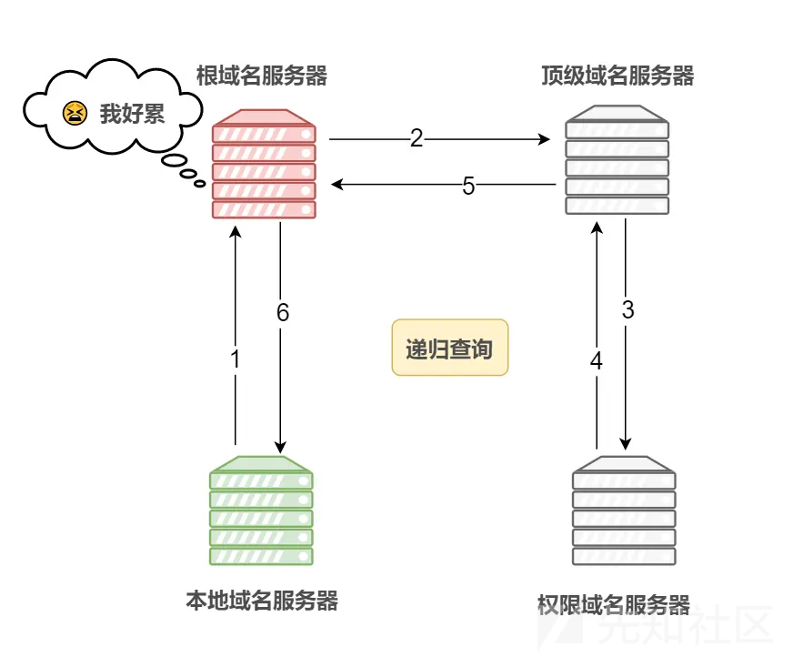
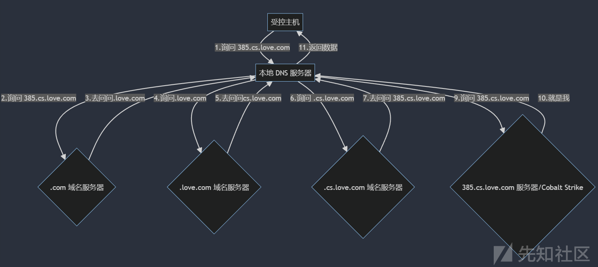

# 深入了解 Beacon 种类及其原理 - 先知社区

深入了解 Beacon 种类及其原理

- - -

## 聊聊什么是 Beacon

Beacon 是 Cobalt Strike 运行在目标主机上的 Payload ，我们可以将它视为 “窃听器” ，可以配合各种方式（可执行文件、Word 文档、目标主机上的漏洞）最终组成一个我们熟悉的名词 —— 木马，最终送达到目标主机上，长期的控制它

[](https://xzfile.aliyuncs.com/media/upload/picture/20240129141052-27dcc808-be6d-1.png)

## Beacon 的安全特性

Beacon 的安全设计其实与 OPSEC 这一概念是密不可分的，OPSEC 的全称是 Operations security，OPSEC 本质上就是在行动阶段就将对立方作为假想敌融入行动计划。早期的远控没有考虑到被对立方发现、溯源的可能性，长期直连受控端，最终导致行动暴露

Beacon 技术最早实现应该是 2017 年泄露的 CIA 的蜂巢（Hive）计划，里面的一项分支技术叫做蜂巢信标基础设施（Hive Beacon Infrastructure），感兴趣的可以看一下这个文件

```plain
https://wikileaks.org/vault7/document/hive-Operating_Environment/hive-Operating_Environment.pdf
```

列举几点 Beacon 的安全设计：

-   Beacon 使用团队服务器的公钥加密传输的元数据，只有团队服务器才能解密这些信息
-   Beacon 传输 Payload 到目标系统时，会验证团队服务器密钥，确保只接受来自团队服务器的任务
-   设置睡眠（Sleep）和抖动（Jitter）时间，Sleep 控制 Beacon 在再次请求前必须睡眠多长时间，Jitter 会改变睡眠时间，从而显示出随机性  
    \## Beacon 的通信模式

Beacon 的通信分为以下两种：

-   **异步式通信**：Beacon 固定一段时间（由 Sleep 时间决定，可调整）向 Teamserver 发起通信，接受本次命令并回传上次执行命令后的结果

[](https://xzfile.aliyuncs.com/media/upload/picture/20240129141242-6928ec7e-be6d-1.png)

-   **交互式通信（Sleep 0）**：由 Client 发出的指令通过 Teamserver（或再经过外部 C2）直接转发给 Beacon 并执行命令

## Beacon 的分类

大致可以将 Beacon 分为以下四类：

-   HTTP (S) Beacon
-   SMB Beacon
-   DNS Beacon
-   TCP Beacon  
    \### HTTP Beacon 和 HTTPS Beacon

HTTP Beacon 与 HTTPS Beacon 的差别仅仅是在通信协议上的不同，相比 HTTP Beacon ，HTTPS Beacon 多了 SSL/TLS 协议，可以保证数据传输中信息不被截取或发生中间人攻击等

> **传输层安全性协议**（英语：**T**ransport **L**ayer **S**ecurity，缩写：**TLS**）前身称为**安全套接层**（英语：**S**ecure **S**ockets **L**ayer，缩写：**SSL**）是一种安全协议，目的是为互联网通信提供安全及数据完整性保障，可以将 TLS 看作 SSL 的加强版本

这里亲测 Cobalt Strike 4.5 版本 HTTPS Beacon 使用的是 `TLS v1.2`

[](https://xzfile.aliyuncs.com/media/upload/picture/20240129141317-7e612ee4-be6d-1.png)

一般情况下，使用 Get 方式请求任务，使用 Post 方式回传数据，通信大致过程如下：

```plain
sequenceDiagram

Teamserver ->> HTTP(S) beancon:HTTP(S)-Get

HTTP(S) beancon ->> Teamserver:HTTP(S)-Post
```

### SMB Beacon

#### Windows 命名管道（Name Pipe）

在介绍 SMB Beacon 前，Windows 命名管道是我们必不可少的前置知识储备，因 Cobalt Strike 原生仅支持 Windows ，我们这里只介绍 Windows 的管道技术

命名管道，顾名思义，就像是数字世界中的孪生兄弟，与我们日常生活中看到的管道有着相似的概念。一个管道具有两端，一段负责向管道写入数据，另一端负责从管道读取数据，在 Windows 中存在两种管道，即命名管道和匿名管道，具体特性如下：

-   **命名管道（Named Pipe）**：适用于持久性、跨进程、双向通信的场景
-   **匿名管道（Anonymous Pipe）**：适用于临时、有亲缘关系的进程间的单向数据传递

> 亲缘关系：当一个进程（称为父进程）创建了另一个进程（称为子进程），这两个进程之间就存在亲缘关系，父进程创建子进程后，子进程通常会继承一些父进程的属性和环境

匿名管道由于其仅能在本地使用且只支持单向通信的特性，在像 Beacon 这样的应用场景中无法满足需求，而命名管道的双向且持久的特性为 Beacon 类似的通信需求提供了合适的基础，以上几点注定了 Cobalt Strike 会选择命名管道

#### SMB 协议

SMB 协议和 Windows 命名管道的关系可以类比成交通规则和交通路网，Windows 命名管道相当于一条条点对点的公路，但是单有交通路网是无法进行交通运输的，有了交通规则，即 SMB 协议才可以实现数据的传输

SMB 全称是 Server Message Block，该协议最初由微软开发，用于在Windows系统中实现文件和打印机共享，后来被广泛用于其他操作系统和网络设备中，我们常用的内网目录共享有些就是通过 SMB 协议实现的

[](https://xzfile.aliyuncs.com/media/upload/picture/20240129141352-92ec277e-be6d-1.png)

#### SMB Beacon 介绍

SMB Beacon 使用命名管道并通过一个父 Beacon 进行通信，管道通信的进程可以是本地主机上的两个进程，也可以和远程主机上的进程通过网络进行通信

SMB Beacon 一般在面对域渗透有机器不出网的场景使用率较高，并且与 Cobalt Strike 中的生成 Payload 的操作是兼容的，简单来说就是使用可以 SMB Beacon 来 Cobalt Strike 原生携带的工具执行各种攻击和渗透测试操作，而不会出现兼容性问题，但某些需要分段传输 Payload 的功能如：packages 模块、Web Driveby 模块需要用户进行额外操作

##### 隐蔽点对点通信（Beacon Covert Peer-to-Peer Communication）

使用 `link [host] [pipe]` 命令可以使一个当前的正在控制的 Beacon 连接到等待连接的 SMB Beacon ，连接后现有 Beacon 和 SMB Beacon 的操作将会同步（更多操作会在操作篇详细说明）

如此图展示，当机器 2 无法直接与 Teamserver 通信时，便可使用 SMB Beacon 来带出机器权限

```plain
sequenceDiagram

Teamserver --> 机器1（HTTP/DNS Beacon）:可通信

机器1（HTTP/DNS Beacon） --> 机器2（SMB Beacon）:可通信

机器2（SMB Beacon） --> Teamserver:不可通信

机器2（SMB Beacon） --> 机器1（HTTP/DNS Beacon）:可通信（SMB Beacon）

机器1（HTTP/DNS Beacon） --> Teamserver:可通信（SMB Beacon）
```

注：

-   目标机器必须开启 445 端口才可使用 SMB Beacon
-   如果需要手动运行 SMB Beacon ，需要从一个父级 Beacon 连接到它，并且这两个 Beacon 需要属于同一 Cobalt Strike 主体
-   一旦 Beacon 使用了这种连接方式，无法再使用 DNS 或 HTTP 协议进行通信
-   SMB Beacon 同一时间只能连接一个父 Beacon，切换父 Beacon 的时候需要在原 Beacon 上先执行一次 unlink 操作
-   取消连接 SMB Beacon 时，它并不会使它消失，而是进入等待连接状态

##### 作为 Payload 通信（Beacon Peer as a Payload）

当攻击者想对已经植入 HTTP Beacon 主机提权时，可以选择将 SMB Beacon 作为 Payload 进行派分和通信，当使用此种方法进行通信时，IP 后会存在 `∞∞` 字符

同时，进行提权后作为 Payload 通信的 SMB Beacon 也可以转为进行隐蔽点对点通信

实践可参考：[https://www.youtube.com/watch?v=D9tMyRUKSPA](https://www.youtube.com/watch?v=D9tMyRUKSPA)

### DNS Beacon

#### DNS 查询方式

DNS 协议可以使用 UDP 或者 TCP 进行传输，使用的端口号都为 53。但大多数情况下 DNS 都使用 UDP 进行传输，DNS 的查询方式一般分为两种：

-   迭代查询：如果接收者 B 没有请求者 A 所需要的准确内容，接收者 B 将告诉请求者 A，如何去获得这个内容，但是自己并不去发出请求，相当于从根域名开始查询直到找到目标域名

[](https://xzfile.aliyuncs.com/media/upload/picture/20240129141434-abed78d6-be6d-1.png)

-   递归查询：如果 A 请求 B，那么 B 作为请求的接收者一定要给 A 想要的答案

[](https://xzfile.aliyuncs.com/media/upload/picture/20240129141504-bdf8a3ca-be6d-1.png)

#### DNS Beacon 原理

DNS Beacon 同时利用了这两种查询方式，详细过程见下图：  
[](https://xzfile.aliyuncs.com/media/upload/picture/20240129141537-d20f0b6a-be6d-1.png)  
其中第 1 步和 11 步属于递归查询，而第 2 步至第 10 步属于迭代查询，简单来说就是在层层迭代后，本地 DNS 服务器终于找到了目标域名对应的域名服务器，而它找到的域名服务器实际上是 Cobalt Strike C2 服务器，最终再由本地 DNS 服务器返回信息给受控主机

#### 数据传递方式

DNS Beacon 支持以下三种 DNS 记录通道：

-   A 记录（mode dns）：A记录是最常见的DNS记录形式，一个A记录指向一个网站或域名的IP地址
-   AAAA 记录（mode dns6）：AAAA记录是IPv6协议的一部分，这意味着它们被用来为互联网上的主机分配IPv6地址
-   TXT 记录（mode dns-txt）：允许你以文本格式添加关于你的域名的额外信息，是 DNS Beacon 的默认传递方式

DNS Beacon 与 HTTP(S) Beacon 最大的区别是心跳时不会主动回传被控端的数据，仅有一个最后通联时间返回，使用 Beacon 控制台输入`checkin`可使心跳时返回数据，但如果通过 DNS Beacon 对受控主机执行命令时则会自动执行`checkin`返回数据

注：

-   使用的所有域名必须要与 Cobalt Strike Teamserver 服务器绑定
-   Teamserver 服务器属于内网环境时，需要将公网 IP 的 53 端口映射到内网的 Teamserver 服务器

### TCP Beacon

#### 何为 Socket

Socket 是个略微抽象的概念，大家可以把 Socket 理解为我们生活中的快递驿站，假设快递公司只知道每个包裹的驿站地址，而驿站负责将包裹再次配送到每家每户

为什么需要Socket进行网络通信？当操作系统接收到一个数据包的时候，如果只有IP地址（驿站地址），它没法判断应该发给哪个应用程序，所以，操作系统抽象出 Socket 接口（快递驿站），每个应用程序需要各自对应到不同的 Socket，数据包才能根据 Socket 正确地发到对应的应用程序

一个 Socket 就是由 IP 地址和端口号（范围是0～65535）组成，可以把 Socket 简单理解为 IP 地址加端口号，端口号总是由操作系统分配，它是一个0～65535之间的数字，其中小于1024的端口属于特权端口，需要管理员权限，大于1024的端口可以由任意用户的应用程序打开

当使用 Socket 连接后：

-   对服务器端来说，它的 Socket 是指定的 IP 地址和指定的端口号
-   对客户端来说，它的 Socket 是它所在计算机的 IP 地址和一个由操作系统分配的随机端口号

#### TCP Beacon 介绍

TCP Beacon 使用 TCP socket 通过父 Beacon 进行通信，且对同一主机和跨网主机都适用。TCP Beacon 整体来说与 SMB Beacon 的特性相同，都需要从父 Beacon 对他进行控制，包括兼容性方面也与 SMB Beacon 一致

如果勾选了 `Bind to localhost only` 就是仅绑定 127.0.0.1 本地 IP，即无法访问远程主机；默认不勾选则是绑定在 0.0.0.0，即监听所有主机

## Listener

Listener 可以看作为与 Beacon 相反的一种形式，Beacon 负责命令执行，并将数据回传，而 Listener 负责整合其他框架或会话。总的来说，Beacon 属于对内监听器，Listener 属于对外监听器

### Foreign Listeners（外部监听器）

Cobalt Strike 前身名为 Armitage，我们可以将 Armitage 看作是 Metasploit 框架的图形化版本，因此可见，Cobalt Strike 与 Metasploit 的兼容性十分良好

[](https://xzfile.aliyuncs.com/media/upload/picture/20240129141612-e6e6b9de-be6d-1.png)

> Metasploit（MSF）是一个免费的、开源的可下载的框架，旨在方便渗透测试，它是由 Ruby 语言编写的模板框架，具有很好的扩展性，便于渗透测试人员开发、使用和定制工具模板

Foreign Listeners 常用于将 Cobalt Strike 与 Metasploit 框架（包括其他支持 MSF 框架的产品）进行整合，最终实现信息整合与 Payload 分发等等功能

### Pivot Listeners（透视监听器）

Pivot Listeners 与对等 C2 的概念密不可分，Pivot Listeners 支持绑定 Beacon 与 SSH 会话，绑定后可以对他们进行反向连接，从而减少 C&C 框架中的连接数量

## 参考 & 引用

```plain
https://www.liaoxuefeng.com/wiki/1252599548343744/1305207629676577
https://hstechdocs.helpsystems.com/manuals/cobaltstrike/current/userguide/content/topics/welcome_main.htm#
https://blog.ateam.qianxin.com/CobaltStrike4.0%E7%94%A8%E6%88%B7%E6%89%8B%E5%86%8C_%E4%B8%AD%E6%96%87%E7%BF%BB%E8%AF%91.pdf
https://segmentfault.com/a/1190000039039275
https://www.bilibili.com/video/BV16b411i7n5p=1&vd_source=2d89987c744dfaecf63d5a95427a4398
https://www.cnblogs.com/xuanlvsec/p/14201986.html
https://blog.51cto.com/u_14028678/3838403
```
